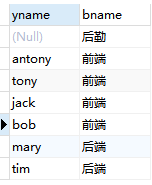
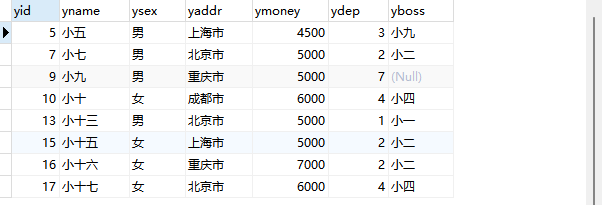

# MySQL笔记

* [1.数据库](#1数据库)
  * [1.1.SQL常用数据类型](#11sql常用数据类型)
  * [1.2.SQL语言](#12sql语言)
  * [1.3.DDL操作数据库](#13ddl操作数据库)
  * [1.4.DDL操作表](#14ddl操作表)
    * [使用数据库](#使用数据库)
    * [创建表](#创建表)
    * [查看库中表](#查看库中表)
    * [查看表详情](#查看表详情)
    * [修改表名](#修改表名)
    * [修改表字段](#修改表字段)
    * [删除表字段](#删除表字段)
    * [删除表](#删除表)
  * [1.5.DML操作数据（增删改）](#15dml操作数据增删改)
    * [增加数据](#增加数据)
    * [修改数据](#修改数据)
    * [删除数据](#删除数据)
  * [1.6.DQL操作表（查）](#16dql操作表查)
    * [简单查询](#简单查询)
    * [条件查询](#条件查询)
    * [模糊查询](#模糊查询)
    * [去除重复](#去除重复)
    * [数据排序](#数据排序)
    * [聚合函数](#聚合函数)
    * [分组查询](#分组查询)
      * [having关键字](#having关键字)
    * [分页查询](#分页查询)
    * [关键字顺序](#关键字顺序)
    * [起别名](#起别名)
  * [1.7.DCL约束数据](#17dcl约束数据)
    * [实体完整性约束](#实体完整性约束)
      * [主键约束](#主键约束)
      * [唯一约束](#唯一约束)
      * [自增约束](#自增约束)
    * [域完整性约束](#域完整性约束)
      * [数据类型约束](#数据类型约束)
      * [非空约束](#非空约束)
      * [默认值约束](#默认值约束)
    * [外键约束](#外键约束)
      * [外界约束使用场景](#外界约束使用场景)
      * [外键约束注意事项](#外键约束注意事项)
      * [三种约束模式](#三种约束模式)
      * [外键约束补充说明](#外键约束补充说明)
  * [1.8.表之间的关系](#18表之间的关系)
    * [一对一关系](#一对一关系)
    * [多对一关系](#多对一关系)
    * [多对多关系](#多对多关系)
  * [1.9.多表查询](#19多表查询)
    * [联合查询(纵向)](#联合查询纵向)
      * [注意事项](#注意事项)
    * [连接查询(横向)](#连接查询横向)
      * [笛卡尔积查询](#笛卡尔积查询)
      * [连接查询](#连接查询)
      * [连接查询图解](#连接查询图解)
      * [内连接查询](#内连接查询)
      * [左外连接查询](#左外连接查询)
      * [右外连接查询](#右外连接查询)
    * [子查询](#子查询)
    * [any/all关键字](#anyall关键字)
      * [any关键字](#any关键字)
      * [all关键字](#all关键字)
  * [1.10.常用函数](#110常用函数)
    * [字符串函数](#字符串函数)
      * [字符串连接函数](#字符串连接函数)
      * [字符串大小写处理函数](#字符串大小写处理函数)
      * [移除空格函数](#移除空格函数)
      * [子串函数](#子串函数)
    * [数值函数](#数值函数)
      * [常用数值函数练习](#常用数值函数练习)
    * [日期函数](#日期函数)
      * [常用日期函数的练习](#常用日期函数的练习)
    * [流程函数](#流程函数)
    * [其他函数](#其他函数)
  * [1.12.事务（TCL）](#112事务tcl)
    * [引入案例：数据库模拟两人转账](#引入案例数据库模拟两人转账)
    * [事务的概念](#事务的概念)
    * [事务的原理](#事务的原理)
    * [事物的操作](#事物的操作)
    * [事务中的回滚点](#事务中的回滚点)
    * [事物的四大特性](#事物的四大特性)
    * [事务的隔离级别](#事务的隔离级别)
  * [1.13.DCL语句](#113dcl语句)
    * [创建用户](#创建用户)
    * [授权用户](#授权用户)
    * [查看权限](#查看权限)
    * [撤销授权](#撤销授权)
    * [修改用户密码](#修改用户密码)
      * [修改管理员密码](#修改管理员密码)
      * [修改普通用户密码](#修改普通用户密码)
    * [删除用户](#删除用户)
* [2.Java数据库连接（JDBC）](#2java数据库连接jdbc)
  * [2.1.JDBC下载装载](#21jdbc下载装载)
  * [2.2.连接数据库概述](#22连接数据库概述)
    * [连接时 url 的设置](#连接时-url-的设置)
    * [会用到的方法](#会用到的方法)
    * [JDBC连MySQL8](#jdbc连mysql8)
    * [概述示例](#概述示例)
  * [2.3.注册驱动](#23注册驱动)
  * [2.4.获得连接对象](#24获得连接对象)
  * [2.5.执行sql语句](#25执行sql语句)
    * [构建SQL工具类](#构建sql工具类)
    * [ResultSet对象](#resultset对象)
  * [2.6.SQL注入问题](#26sql注入问题)
    * [引入案例：模拟登录验证](#引入案例模拟登录验证)
    * [SQL注入问题](#sql注入问题)
    * [解决SQL注入问题](#解决sql注入问题)
  * [2.7.获取自增长键值](#27获取自增长键值)
    * [获取自增长键值的应用场景](#获取自增长键值的应用场景)
    * [获取自增长键值的步骤](#获取自增长键值的步骤)
  * [2.8.批量处理](#28批量处理)
    * [批处理优势和应用场景](#批处理优势和应用场景)
    * [批处理的具体操作步骤](#批处理的具体操作步骤)
  * [2.9.JDBC中事务的操作](#29jdbc中事务的操作)
    * [事务操作的步骤](#事务操作的步骤)
    * [事务相关API](#事务相关api)
    * [使用JDBC的事务完成转账案例](#使用jdbc的事务完成转账案例)
      * [准备数据](#准备数据)
      * [代码实现](#代码实现)
  * [2.10.数据库连接池](#210数据库连接池)
    * [什么是数据库连池](#什么是数据库连池)
    * [为什么要使用连接池](#为什么要使用连接池)
    * [连接池的优势](#连接池的优势)
    * [连接池的原理](#连接池的原理)
    * [连接池的实现](#连接池的实现)
      * [DataSource接口](#datasource接口)
      * [常见的数据库连接池](#常见的数据库连接池)
      * [Druid连接池的使用](#druid连接池的使用)
      * [Druid连接池的配置参数列表](#druid连接池的配置参数列表)
  * [2.11.封装JDBCTools](#211封装jdbctools)
    * [连接池使用的总结](#连接池使用的总结)
  * [2.12.Apache的DBUtils](#212apache的dbutils)
    * [DBUtils的概述](#dbutils的概述)
    * [DBUtils执行增删改的SQL语句](#dbutils执行增删改的sql语句)
      * [API介绍](#api介绍)
      * [代码实现](#代码实现-1)
    * [DBUtils执行批处理](#dbutils执行批处理)
      * [API介绍](#api介绍-1)
      * [代码实现](#代码实现-2)
    * [使用QueryRunner类实现查询](#使用queryrunner类实现查询)
      * [API介绍](#api介绍-2)
      * [代码实现](#代码实现-3)

# 1.数据库

**概念：**

存放数据的仓库；

**数据库的厂商：**

MySql（Oracle），Oracle（Oracle），SQL Sever（微软），DB2（IBM）……

在现在主流的互联网后端开发，适用于高并发、高可用、高性能的数据库首先 MySql；

MySql 实际上是一款软件，使用这款软件来创建数据的仓库，因此这种软件也称为数据库管理软件；

**数据的定义：**

Java 中的数据就是一个 Java 对象，也就是说由多个属性和属性值组成的一条记录；

一个或多个数据存放在一条记录中，一个或多个记录存放在一张表里，一张或多张表存放在一个数据库里，数据库存放在数据库管理系统（例如：MySql……）当中；

==一定要下载 MySql 8 以上的版本，不然需要自行配置中文的输入；==

## 1.1.SQL常用数据类型

- **数值**

  - 整数

    - tinyint     <==>  极小整型   默认长度：4位数；
    - smallint  <==>  小整型      默认长度：6位数；
    - int           <==>   整型          默认长度：11位数；
    - bigint      <==>   大整型     默认长度：20位数；

  - 小数

    - float        <==>   单精度；

    - double    <==>   双精度；

    - decimal    <==>  精确的小数   默认decimal(10.0) 括号中的 10 表示存数值的位数，0 表示小数保留位数；

      原因简述：由于 float 和 double 在底层是二进制储存的，所以会有转换成二进制的算法过程，即除以二，所以我们要实现例如 1.5 这个数的时候，float 和 double 产生一个无限接近 1.5 的小数（因为除不尽），所以数据库会用 decimal 来直接描述 1.5 这个数；

- 字符

  - char                   固定长度字符串（限制字符串长度，不得超过，不满则补空格）；
  - varchar(255)     可变长度字符串     varchar 需要指明长度，最多不能超过 255；
  - text                     大文本，无长度约束；
  - blob                    用于存放二进制，比如图片，但是不怎么用，没必要存放图片本身，只要存放图片路径就行；

- 时间

  - date				年月日

  - time                时分秒

  - datetime        年月日 时分秒

  - timestamp     自动生成的年月日 时分秒，

    ==时间戳这个地方需要注意一下自动生成的问题，这里的自动生成需要注意一下 SQL 语句默认值，有时候这个默认值为 null，那么它就不会自动输出；==

## 1.2.SQL语言

SQL英文：Structure Query Language（结构化查询语言）

SQL 语言用于操作数据库以及数据的操作，被美国国家标准局确定为关系型数据库语言的美国标准；

也就是说各大厂商都是用 SQL 语言进行数据操作的，我们使用 SQL 语言要做的事情就是对数据的增删改查，简称 CRUD（Create 创建，Read 查询，Update 更新，Delete 删除）；

SQL 语言从细节上划分为以下几种：

$$
SQL\begin{cases}DDL:Date\ Define\ Language\ \bf{数据库定义语言}\\DML:Data\ Manipulation\ language\ \bf{数据操纵语言}\\DQL:Doctrine\ Query\ Language\ \bf{数据查询语言}\\DCL:Data\ Control\ Language\ \bf{数据控制语言}\end{cases}
$$
==在下载完成之后，配置好相关环境，就可以在不使用 MySQL 8.0 Command Line Client 的情况下使用 cmd 就能完成数据库的启动：mysql -uroot -p==


## 1.3.DDL操作数据库

==增删改查（create，drop，alter，show）==

- **`show databases;` 查看当前数据库管理软件中的所有数据库；**

  

- **`create database 数据库名;`  创建默认字符集的数据库；**

  

- **`create database 数据库名 character set utf8;`  创建带有字符集的数据库；**

  

- **`show create database 已有的数据库名;`  查看已经创建好的数据库具体属性；**

  

- **`alter database 需要修改的数据库名 character set 新的字符集;`  修改数据库的字符集；**

  

- **`drop database 数据库名;`  删除数据库；**

  

## 1.4.DDL操作表

### 使用数据库

因为表在数据库中，所以我们要进入数据库去进行操作，即 **`use 数据库名`** ；


此时我们就进入了该数据库；

### 创建表

**`create table 表名(各种属性名/各种字段名/各种列名);`  创建一个默认字符集（数据库的字符集）的表；**  

```mysql
create table tb_name(
id bigint,
name varchar(50),
sex char(1)
);
```


**`create table 表名(各种属性名/各种字段名/各种列名) charset=字符集名`  创建一个带有字符集的表；**

```
create table tb_name(
id bigint,
name varchar(50),
sex char(1)
) charset=utf8;
```


### 查看库中表

**`show tables;`  查看该数据库的所有表；**


### 查看表详情

**`show create table 表名;`  查看某一个表的详细情况（未排版）；**


tip：对于 MySql ，有两大引擎，一个是 InnoDB ，另一个是 MyIASM；

**`decs 表名;`  查看某一个表的详细情况（已排版）；** 


### 修改表名

**`rename table 旧表名 to 新表名;`  修改表名；**


### 修改表字段

**`alter table 表名 add 列名及数据类型;`  为表添加一个新的列；**


**`alter table 表名 modify 需要修改的列名以及其修改后数据类型和约束;`  修改一个列的数据类型；**


**`alter table 表名 change 原列名 修改后的列名及其数据类型和约束;`  修改一个列的列名及数据类型和约束；**


### 删除表字段

**`alter table 表名 drop 需要删除的列名;`  删除某一列；**


### 删除表

**`drop 表名;`  删除整个表；**


- **`truncate 表名;`  删除表，并且创建一张相同新表；**

  

## 1.5.DML操作数据（增删改）

### 增加数据

**插入数据方式一（插入一个全字段值）：`insert into 表名 values(具体的值);`** 

==注意：插入数据时，字符串必须用单引号或双引号包括；==


**插入数据方式二（插入一个部分字段值）：`insert into 表名(需要插入的列名一、列名二……) values(对应的数据一、数据二……);`**  


**插入数据方式三（插入多个全字段值）：**

**`insert into 表名 values(字段一及数据类型),(字段二及数据类型)......;`**


**插入数据方式四（插入多个部分字段值）：**

**`insert into 表名(需要插入的列名一、列名二……) values(对应字段一及数据类型),(对应字段二及数据类型)......;`**


### 修改数据

**修改数据方式一（改一列数据）：**

**`update 表名 set 列名=修改内容 where 列名(多是特有的列名)=指定的数据项 or ......;`**


**修改数据方式二（改多列数据）：**

**`update 表名 set 列名一=修改内容,...... where 列名(多是特有的列名)=指定的数据项 or ......;`**


### 删除数据

**删除数据方式一（删除表中指定位置记录）；**

**`delete from 表名 where 列名(多是特有的列名)=指定的数据项;`**


==谨慎使用 **delete from 表名** ，那样会删除整个表；==

**删除数据方式二（清空表）；**

**`truncate 表名;`**


==先 drop 表，再创建一张一模一样的新表；==


## 1.6.DQL操作表（查）

==在 SQL 语言中的注释是 **“#”/“--”**==

### 简单查询

**查询表中所有的记录；**

==注意 select 语句查询出来的表，是一张存放在内存中的虚拟的表，而非存在于硬盘中的原始的表，换句话说，select 操作并不会对表的内容产生影响；==

全字段查询：

**`select * from 表名;`** 

部分字段查询：

**`select 字段一，字段二...... from 表名;`** 

示例如下：被操作表单；


全字段查询：


部分字段查询：


### 条件查询

**设置 where 条件去查询；**

全字段条件查询：

**`select * from 表名 where 条件;`**

部分字段条件查询：

**`select 字段一，字段二...... from 表名 where 条件;`** 

==MySql 的条件相当于 java 中的比较运算符有	**>（大于）**	**<（小于）**	**>=（大于等于）**	**>=（小于等于）**	**!=（不等于）**	**=（等于）**	**<>（不等于）**	**and（且）**	**or（或）**	**between 数值1 and 数值2（之间）**	**被判断字段 in (判断范围)（判断是否在其中）**	**is null（判断是否为空）**	**is not（否定）**；==

示例如下：被操作表单；


全字段条件查询：


部分字段条件查询：


### 模糊查询

**设置 where …… like …… 条件，模糊的查询；**

全字段模糊查询：

**`select * from 表名 where 某字段 like 类正则表达式;`**

部分字段模糊查询：

**`select 字段一，字段二...... from 表名 where 某字段 like 类正则表达式;`** 

SQL 中的模糊查询需要运用到类似正则表达式的匹配表达：

1. **`%`** ：表示任意0个或多个字符。可匹配任意类型和长度的字符，有些情况下若是中文，请使用两个百分号（%%）表示。
2. **`_`** ： 表示任意单个字符。匹配单个任意字符，它常用来限制表达式的字符长度语句。
3. MySQL中的转义字符是 `\`；

示例如下：被操作表单；


模糊查询示例如下：


### 去除重复

用 distinct 关键字对数据进行去重；

**`select distinct 需要去重的字段一，字段二…… from 表名;`** 

==这里的字段一和字段二必须是参杂重复数据的字段，如例一个学生表中有学号，姓名，年龄和手机号，而输入的时候，我们在不同学号下输入了两个拥有完全相同姓名，年龄，手机号的学生，那么这个字段可以是姓名，年龄，手机号之中的一种或多种，但就是不能包括学号，而且返回显示的表格里仅出现输入进去的字段数据；== 

### 数据排序

**用 order by 关键字对数据进行排序；**

**升序：**`select * from 表名 order by 字段;` 

**降序：**`select * from 表名 order by 字段 desc;` 

==排序的字段可以添加多个，实现排序后再排序，前面的字段先排序，后面的字段再排序；==

排序示例如下：被操作表单；


按照升序年龄层划分将薪水倒序排列：


升序示例如下：


降序示例如下：


==若想要添加排序条件，一定要注意，挑选之后才能排序，所以 where 语句应该写在 order by 语句前面；==

### 聚合函数

聚合函数是用来做纵向运算的函数，且==聚合函数发生在筛选后==；

**基本的一些函数语法：**

sum()  相加；

count()  计数，主要是记录==非空数据==条数；

avg()  求平均值；

min()  求最小值；

max()  求最大值；

**格式如下：**

`select 函数(字段) from 表名;`

**示例如下：被操作表单；**


求和：


计数：


求男性工作者的薪水平均值：


求女性工作者的薪水最小值：


求男性工作者的薪水最大值：


### 分组查询

**基本格式：**

`select 操作(字段) from 表名 group by 分组字段; `

**公司架构图示例：**


==我们经常会遇到一些类似于公司架构的数据表，里面通常会包含部门这一字段，而当我们想仅统计某一个部门的数据时就会用到分组查询，分组查询的关键字是 **group by** ，而当我们使用 **select \* from 表名 group by 分组字段** 后返回的却是表中部门遍历到的第一行数据，有几个部门就会输出几行数据，图示如下：==


==这里我们需要注意，这一行数据并不代表结果，因为当我们用了 **group by** 关键字后，生成的每一条数据里面包含了同字段所有数据的处理结果，比如 **sum()**，**count()**等函数，即把同字段所有数据抽象成一条数据输出出来；==

所以我们可以直接操作 **\*** 处代码来输出我们想的内容，例如我想知道这个公司里每一组的人数：


再比如我想知道每一组的平均薪水：


==所以分组查询并不是用于显示组中每一条数据的信息，而是用于显示整个组的相关情况；==

#### having关键字

以上都是我们在解决筛选之后再进行分组，即 where 之后的操作；

而 having 关键字则解决的是分组后的筛选问题；

**下面我们直接根据示例来演示这一过程：**

我们要筛选出平均薪水高于 5000 的部门编号以及部门的最大薪水；


having 和 where 的区别：

where 是磁盘级的，是对磁盘数据做一次筛选，在产生虚拟表；having 是内存级的，是对分组后在内存里产生的虚拟表进行筛选；

### 分页查询

我们在一些购物软件中搜寻意一件常用商品时，由于数量众多会设置页码，然后分页显示，这就是从数据库中拿出了一部分显示在第一页，再拿出一部分显示在第二页，以此类推；

**数据库中我们用 limit 进行分页：**

示例如下：被操作表单；


**使用 `limit 数值` 进行裁剪；**

将薪水最高的三个人的详细信息打印出来（思路：排序之后裁剪前三项）；


**使用 `limit 起始索引,页容量` 来分页操作；**

将该表单中的数据分为四个一组；


### 关键字顺序

我们先来引出一个示例来说明这个较为复杂的问题：

示例如下：被操作表单；


查询每一个部门中女性工作者的薪水总数，而且薪水总数是高于10000，再将这样的信息降序排序；


**通过上例可以得到关键字的书写顺序：**

select	==>	from	==>	where	==>	group by	==>	having	==>	order by	==>	limit

**进而可以分析得到关键字的执行顺序：**

from	==>	where	==>	select	==>	group by	==>	having	==>	select	==>	order by	==>	limit

用中文描述就是：从（from）虚拟表（where）中筛选（select）出范围，然后分组（group by），又将分组的结果按照一定条件（having）再筛选（select）出来，最后将结果排序（order by）和分页（limit）；

### 起别名

起别名主要是针对一张表用于不同的场景时，标头字段需要更改的情况；

**给字段起别名格式如下：**

`select 字段一 as 别名一,字段二 as 别名二 from 表名;`

或者

``select 字段一 别名一,字段二 别名二 from 表名;`

**示例如下：**


如果我们在 select 关键字后给字段设置了别名，那么后续的代码我们就可以用别名来替代字段名；


**给表起别名格式如下：**

==首先我们得理解一个问题，那就是 **select * from 表名** 创建了一个新虚拟表，那么它也是一个类似于磁盘表的数据结构，那就可以在此基础上再创建表，此时给这一张虚拟表起别名就有了意义；==

**格式如下：**

`select * from (select * from 表名) as 别名;`

或者

`select * from (select * from 表名) 别名;`

**示例如下：**


## 1.7.DCL约束数据

**数据的约束：**指的是在往表里面操作数据时防止某一种错误的发生，因此提供了约束；

==保证数据的完整性 == 在创建表时给表中添加约束；==
$$
完整性分类\begin{cases} 实体完整性 \\ 域完整性 \\ 引用完整性 \end{cases}
$$

### 实体完整性约束

#### 主键约束

**基本格式：** `primary key`

**主键约束的作用：**

- 表里的主键保证表里的数据是唯一的，比如一张表的 id 字段作为主键，呢么一张表里就不能有多条相同的 id 的记录出现；

- 表里的主键不能为空，因为主键是唯一标识实体的字段；

**主键约束的创建：**

==注意：一张表里只能有一个主键，一个主键可以由一个字段组成，也可以由多个字段组成（此时称之为联合主键，两个字段满足主键条件才能输入）；==

- **方式一：创建字段时，在主键字段后面加上 `primary key`；**

  ```mysql
  CREATE TABLE Person (
  	id INT PRIMARY KEY,  #id是主键
  	name VARCHAR ( 50 ),
  	sex CHAR ( 1 )) 
  CHARSET = utf8;
  ```

  效果如下：

  

- **方式二：用 `modify` 为已经存在的表修改主键；==就是 DML 中对数据的修改==**

  ```mysql
  ALTER TABLE tb1 MODIFY id CHAR (6) PRIMARY KEY;
  ```

  效果如下：

  

  但是这种修改方式想要成功，就必须要让这个被修改字段满足主键的要求；

- **方式三：用 `add` 将已经存在的字段添加为主键；==也是 DML 中对数据的修改==**

  ```mysql
  ALTER TABLE tb1 add PRIMARY KEY(id);
  ```

  效果如下：

  

  方式三和方式二大同小异，区别之一是方式三不需要知道字段的数据类型，其次是第三种方式需要注意格式，即 `primary key(已有字段)`；

- **方式四：联合主键的创建；**

  ```mysql
  CREATE TABLE tb (
  	uid INT,
  	uname VARCHAR ( 50 ),
  usex CHAR ( 1 ),
  PRIMARY KEY ( uid, uname ));
  ```

  效果如下：

  

- **方式五：用 `add` 将已经存在的多个字段添加为主键；==也是 DML 中对数据的修改==**

  ```mysql
  ALTER TABLE tb1 add PRIMARY KEY(id,name);
  ```

  效果如下：

  

#### 唯一约束

只是让表中的记录的某一列的值是唯一的，但不起到标识一个实体的作用，就可以使用唯一约束；

唯一约束是在需要约束字段后使用关键字 `unique` 实现的，示例如下:

- **方式一：在创建表时添加唯一约束；**

  ```mysql
  CREATE TABLE tb (
  	uid INT,
  	uname VARCHAR ( 50 ) UNIQUE,
  usex CHAR ( 1 ))
  ```

- **方式二：在表创建后使用 `modify` 添加唯一约束；**

  ```mysql
  ALTER TABLE tb MODIFY uid int UNIQUE;
  ```

- **方式三：在表创建后使用 `add` 添加唯一约束；**

  ```mysql
  ALTER TABLE tb add UNIQUE(usex);
  ```

  效果如下：

  

  

  

#### 自增约束

如果我们想让一个 id 自动去填充它的数值，例如第一个是 1 ，第二个自动会增长为 2，以此类推；

我们在==整数主键==后面使用 **auto_increment** 关键字就能达到这样的效果；

示例如下：

```mysql
CREATE TABLE tb (
	uid INT PRIMARY KEY auto_increment,
	uname VARCHAR ( 50 ),
usex CHAR ( 1 )) CHARSET = utf8;
```

==注意：自动增长的值是在该表中已经生成的最大值的基础上+1，即使该最大值被删除了，但是记录还在；==

### 域完整性约束

#### 数据类型约束

一个列中的值插入时，必须满足设计表时指定的数据类型；

==插入时间：==

```mysql
CREATE TABLE tb (
    -- 时间年月日
    uday DATE,
    -- 时间年月日时分秒
	utime datetime,
    -- 时间默认的时间戳
	utimestamp TIMESTAMP DEFAULT CURRENT_TIMESTAMP
);
-- 使用当前的时间
INSERT INTO tb VALUES(NOW(),NULL,DEFAULT);
-- 使用指定的时间年月日（date）  格式要求：yyyy-MM-dd
INSERT INTO tb VALUES('2022-3-16',NULL,DEFAULT);
-- 使用指定的时间年月日时分秒（datetime）  格式要求：yyyy-MM-dd-HH-mm-ss
INSERT INTO tb VALUES(NULL,'2022-3-16-08-10-01',DEFAULT);
-- 打破默认的时间戳
INSERT INTO tb VALUES(NULL,NULL,'2022-3-15-08-10-01');
```

效果如下：


#### 非空约束

非空的数据项不能为NULL；

**基本格式：** `字段名 数据类型 NOT NULL` 

```mysql
CREATE TABLE tb (
	uid VARCHAR(50) PRIMARY KEY,
	uname VARCHAR ( 50 ) NOT NULL,
usex CHAR ( 1 )) CHARSET = utf8;
```

效果如下：


#### 默认值约束

一个单元格中会存在一个默认值，也就是不给该单元格值（手动给单元格插入NULL也算是给该单元格值）的时候，会采用设置的默认值；

**基本格式：**  `字段名 数据类型 NOT NULL` 

```mysql
CREATE TABLE tb ( 
	uid VARCHAR ( 50 ) PRIMARY KEY, 
	uname VARCHAR ( 50 ), 
	usex CHAR ( 1 ) DEFAULT '男' 
) CHARSET = utf8;
```

效果如下：


### 外键约束

**我们先引入一个示例：**我们有一张学生表，和一张班级表，班级中有 1，2，3 班，按理说学生表中的班级不能出现除这三个班以外的班级，但是用户输入我们并不能用已学知识做到输入限制，所以这里需要用到外键约束（引用完整性约束/参考完整性约束）；

==一个表中可以有很多外键；==

**基本格式：**

创建表时：`foreign key (原表字段) references 引用表表名(外键字段);`

```mysql
-- 班级表  一定要先创建引用表
CREATE TABLE class(
class_id BIGINT PRIMARY KEY auto_increment,
class_name VARCHAR(50),
class_location VARCHAR(100));
-- 学生表  在创建原表
CREATE TABLE student(
stu_id BIGINT PRIMARY KEY auto_increment,
stu_name VARCHAR(50),
stu_class BIGINT,
FOREIGN KEY (stu_class) REFERENCES class(class_id)  -- 另起一行单独写外键
);
```

添加表时：`alter table 愿表名 add foreign key (原表字段) references 引用表表名(外键字段);`

```mysql
-- 班级表
CREATE TABLE class(
class_id BIGINT PRIMARY KEY auto_increment,
class_name VARCHAR(50),
class_location VARCHAR(100));
-- 学生表
CREATE TABLE student(
stu_id BIGINT PRIMARY KEY auto_increment,
stu_name VARCHAR(50),
stu_class BIGINT);

ALTER TABLE student ADD FOREIGN KEY (stu_class) REFERENCES class(class_id);
```

效果如下：


这样操作之后就能约束用户的输入，同时也为两个表之间创建了关系；

#### 外界约束使用场景

一张表中的一个列中的值，可以是任意的值，也可以是指定范围的值，如果希望该值是取自于某一张表内已有的值，那么就可以通过外键约束来实现，比如一个学生的班级编号必须是已有班级的编号；

#### 外键约束注意事项

- ==所谓的外键，其实是一个表里的一个列，该列必须引用自另外一张表的唯一性字段，比如主键，此时该列就成为外键，该表就称为从表，另一张被参考的表称为主表；==
- ==外键的数据类型必须和主键的数据类型完全相同，但是列名可以不同；==
- ==外键可以是 NULL 值；==
- ==主表中主键的值如果被操作，会影响到外键，所以大多数数据库软件会报错；==

#### 三种约束模式

- ==上面第四点提到的影响分两种：第一种是主表被引用字段如果被删除，从表外键字段不会跟着被删除；第二种是主表被引用字段如果更新，从表外键字段不会跟着被跟新；所以根据这两种影响可以把外键约束分为三种模式：==

- **严格模式（district）：**

  - 如果外键有记录被外键引用，则不能删除该外键；

- **级联模式（cascade）：**

  - 当主表中被关联的字段更改时，从表中的外键字段也会跟着更改；

  - ==主要应用在更新（update）上；==

    **示例如下：**

    ```mysql
    -- 创建主表
    CREATE TABLE tb_a(
    id BIGINT PRIMARY KEY auto_increment);
    
    -- 创建从表
    CREATE TABLE tb_b(
    id BIGINT PRIMARY KEY auto_increment,
    name VARCHAR(50),
    a_id BIGINT,
    -- 此时为了避免外键连接的限制，即不可修改主表中的被关联的字段
    -- 我们可以设置一个当主表字段被修改时，从表外键跟着更改的操作
    -- 即 ON UPDATE CASCADE
    FOREIGN KEY (a_id) REFERENCES tb_a(id) ON UPDATE CASCADE
    );
    ```

- **置空模式（set null）：**

  - 当主表中被关联的字段被删除时，从表中的外键字段变成 NULL；

  - ==主要应用在删除（delete）上；==

    **示例如下：**

    ```mysql
    -- 创建主表
    CREATE TABLE tb_a(
    id BIGINT PRIMARY KEY auto_increment);
    
    -- 创建从表
    CREATE TABLE tb_b(
    id BIGINT PRIMARY KEY auto_increment,
    name VARCHAR(50),
    a_id BIGINT,
    -- 此时为了避免外键连接的限制，即不可删除主表中的被关联的字段
    -- 我们可以设置一个当主表字段被删除时，从表外键置空的操作
    -- 即 ON DELETE SET NULL (当tb_a(id)被删除则a_id设置成null)
    FOREIGN KEY (a_id) REFERENCES tb_a(id) ON DELETE SET NULL
    );
    ```

- **注意：** 级联模式和置空模式可以一起写；

  **示例如下：**

  ```mysql
  -- 创建主表
  CREATE TABLE tb_a(
  id BIGINT PRIMARY KEY auto_increment);
  
  -- 创建从表
  CREATE TABLE tb_b(
  id BIGINT PRIMARY KEY auto_increment,
  name VARCHAR(50),
  a_id BIGINT,
  -- 置空模式和级联模式可以一起写
  FOREIGN KEY (a_id) REFERENCES tb_a(id) ON UPDATE CASCADE ON DELETE SET NULL 
  );
  ```

#### 外键约束补充说明

如果我们想要简单地删除外键，那么我们可以在创建外键时给外键取一个名字，如果我们不写，那么 MySQL 会帮助我们为其命名，但是它所命名十分复杂且难以找到，我们删除外键时会很麻烦；

**命名外键基本格式：** 

创建表时：

`constraint 外键名 foreign key (原表字段) references 引用表表名(外键字段);`

添加表时：

`alter table 愿表名 add constraint 外键名 foreign key (原表字段) references 引用表表名(外键字段);`

**删除外键基本格式：** `alter table 表名 drop foreign key 外键名;`

## 1.8.表之间的关系

- 一对一        

  比如一个人的个人信息（教育信息，身体信息，家人信息）如果全在一张表中，表的字段会非常多，因此让不同的表呈现出不同种类的信息，但是这些信息还是这个人的，每张表中记录之关于这个人，因此就形成了表与表之间的一对一关系；

- 一对多        

  比如一个班级和多个学生，一个医生和多个病人……

- 多对多

  一个学生可以选择多门课，但是每一门课也可以被多个学生选择；

### 一对一关系

**定义：**一张表中的一条记录对应着另一张表中的一条记录；

**建立方法：**

1. 创建外键约束：

   也就是说 tb_info 的 edu_id 是外键，引用自 tb_eduinfo 的主键 id ，但是这种外键约束会造成两张表的多对一关系，也就是 tb_info 表中可以有多条记录引用 tb_eduinfo 中的一条记录；

2. 创建唯一约束：

   为了解决第一步中的问题，可以让外键的值是唯一的，即就实现了一对一关系；

**示例如下：**

```mysql
CREATE TABLE tb_info(
id INT PRIMARY KEY auto_increment,
name VARCHAR(50) NOT NULL,
high DOUBLE,
weight DOUBLE,
edu_id INT,
family_id INT
);

CREATE TABLE tb_eduinfo(
id INT PRIMARY KEY auto_increment,
education VARCHAR(100),
school VARCHAR(100)
);

CREATE TABLE tb_family(
id INT PRIMARY KEY auto_increment,
homeaddress VARCHAR(100),
homepeople VARCHAR(100)
);

-- 创建 tb_info 和 tb_eduinfo 之间一对一关系
ALTER TABLE tb_info ADD UNIQUE (edu_id);
ALTER TABLE tb_info ADD FOREIGN KEY (edu_id) REFERENCES tb_eduinfo(id);

-- 创建 tb_info 和 tb_eduinfo 之间一对一关系
ALTER TABLE tb_info ADD UNIQUE (family_id);
ALTER TABLE tb_info ADD FOREIGN KEY (family_id) REFERENCES tb_family(id);
```

### 多对一关系

**定义：** 一张表中的一条记录对应着另一张表的多条记录；

**创建方法：**

通过创建外键约束来实现多对一关系；

**示例如下：**

```mysql
CREATE TABLE doctor(
id BIGINT PRIMARY KEY auto_increment,
name VARCHAR(50)
);

CREATE TABLE nurse(
id BIGINT PRIMARY KEY auto_increment,
name VARCHAR(50),
doctor_id BIGINT,
-- 创建 doctor 和 nurse 之间的一对多关系
FOREIGN KEY (doctor_id) REFERENCES doctor(id) 
);
```

### 多对多关系

**定义：**一个表中的多条记录对应着另一张表的多条记录；

**创建方法：**

多对多之间关系的建立必须由中间表来实现，分别创建中间表和需要创建多对多关系的两表之间的一对多关系，进而形成量表之间的多对多关系；

**示例如下：**

```mysql
CREATE TABLE tb_student(
sid BIGINT PRIMARY KEY auto_increment,
sname VARCHAR(50));

CREATE TABLE tb_course(
cid BIGINT PRIMARY KEY auto_increment,
cname VARCHAR(50));

-- 中间表：选课表
CREATE TABLE tb_selectc(
id BIGINT PRIMARY KEY auto_increment,
stu_id BIGINT,
c_id BIGINT,
-- 这里可以向上面这样单独设置一个主键
-- 也可以设置一个联合主键

-- 创建 tb_student 和 tb_course 的多对多关系
-- 首先创建 中间表 和 tb_student 的一对多关系
FOREIGN KEY (stu_id) REFERENCES tb_student(sid),
-- 然后创建 中间表 和 tb_course 的一对多关系
FOREIGN KEY (c_id) REFERENCES tb_course(cid)
-- 进而形成 tb_student 和 tb_course 之间的多对多关系
);
```

## 1.9.多表查询

### 联合查询(纵向)

**关键字：**`union` 和 `union all`；

**现有两张表：**


**union 示例如下：**

```mysql
SELECT * FROM tb_1 UNION SELECT * FROM tb_2;
```

展示效果如下：


特点： 能够自动去除两张表中的重复；

**union all 示例如下：**

```mysql
SELECT * FROM tb_1 UNION ALL SELECT * FROM tb_2;
```

展示效果如下：


特点：展示两张表中所有的内容，不会自动去除重复；

#### 注意事项

- 联合查询的多张表列的数量必须相同；
- 联合查询的多张表的列名和数据类型可以不同；

### 连接查询(横向)

**现有两张表：**


#### 笛卡尔积查询

这也是普通的连接查询，即一张表中的一条记录对应另一张表中的所有记录，并且横向输出；

**笛卡尔积查询示例如下：**

```mysql
SELECT * FROM tb_1,tb_2;
```

展示效果：


#### 连接查询

连接查询就是在笛卡尔积上作出 **where** 限制，例如我们想要两表中 id 相同的姓名记录合并，作为一条记录查询；

**示例如下：**

```mysql
SELECT * FROM tb_1,tb_2 WHERE tb_1.a = tb_2.a;
-- 在数据库中的"."号类似于Java的"."号
```

展示效果如下：


如果我们只想把第一个表中的姓名和第二个表中的姓名查询出来，可以通过改变 \* 号为具体的字段来实现：

```mysql
SELECT tb_1.b,tb_2.b FROM tb_1,tb_2 WHERE tb_1.a = tb_2.a;
```

展示效果如下：


#### 连接查询图解


==比如此时有两张表，一张是公司员工表（左表），包含着员工号，员工姓名和部门号；另一张表是公司部门表（右表），包含着部门号，部门名；==

- ==假设所有员工都有对应的一个部门号，所有部门都有对应的部门号，此时使用的连接操作查询所有员工姓名以及对应的部门名，均为内连接查询；==

- ==假设其中一个员工"Tim"不属于任何部门（为空），查询所有员工姓名和其对应的部门名，则为左外连接查询；==
- ==假设其中一个部门"后勤"没有任何一个员工（为空），查询所有部门名和其对应的员工姓名，则为右外连接查询；==

**表格如下：**

- 内连接情况：

  

- 左外连接情况：

  

- 右外连接情况：

  

#### 内连接查询

内连接查询也是将两张表中符合某个条件的数据筛选出来，只是写法不一样；

**格式如下：**

```mysql
select * from 表一 inner join 表二 on 表一.字段=表二.字段;
-- 其中 inner 可以省略
```

**示例如下：**

```mysql
SELECT yname,bname FROM a JOIN b ON a.bid=b.bid;
```

展示效果：


#### 左外连接查询

**格式如下：**

```mysql
select * from 表一 left join 表二 on 表一.字段=表二.字段;
```

**示例如下：**

```mysql
SELECT yname,bname FROM a LEFT JOIN b on a.bid=b.bid;
```

展示效果：


#### 右外连接查询

**格式如下：**

```mysql
select * from 表一 right join 表二 on 表一.字段=表二.字段;
```

**示例如下：**

```mysql
SELECT  FROM tb_1 RIGHT JOIN tb_2 ON tb_1.bid=tb_2.bid;
```

展示效果：



### 子查询

在一个查询语句中嵌套者另一个或者多个查询语句；

==当我们想要查询的结果是来自另一个查询后的虚拟表的内容时，就要用到子查询这种嵌套的查询方式；==

**子查询分类：**

- 标量子查询：子表会产生一行一列的记录；

  查询工资高于平均工资的员工信息：

  子查询如下：

  ```mysql
  SELECT AVG(ymoney) FROM yuangong;
  ```

  父查询如下：

  ```mysql
SELECT * FROM yuangong WHERE ymoney > (SELECT AVG(ymoney) FROM yuangong);
  ```

- 列子查询：子查询会产生一列的记录；

  查询身份是上司的员工信息：

  子查询如下：

  ```mysql
  SELECT yboss FROM yuangong;
  ```

  父查询如下：

  ```mysql
SELECT * FROM yuangong WHERE yname IN (SELECT yboss FROM yuangong); 
  ```

- 行子查询：会产生一行多列或多行多列的记录；

  查询和小二上司相同且工资也相同的员工信息：

  子查询如下：

  ```mysql
  SELECT yboss,ymoney FROM yuangong WHERE yname = '小二'
  ```

  打印效果如下：

  

  父查询如下：

  ```mysql
  SELECT * FROM yuangong WHERE (yboss,ymoney) IN (SELECT yboss,ymoney FROM yuangong WHERE yname = '小二');
  ```

  打印效果如下：

  

- 表子查询：会产生一张虚拟表；

  查询出工资最高（使用排序方式）的前五名员工信息：

  子查询：

  ```mysql
  SELECT * FROM yuangong ORDER BY ymoney DESC;
  ```

  打印效果如下：

  

  父查询：

  ```mysql
  SELECT * FROM (SELECT * FROM yuangong ORDER BY ymoney DESC) AS son LIMIT 5;
  ```

  打印效果如下：

  

  ==注意表子查询一定要给虚拟表起别名；==

### any/all关键字

#### any关键字

查询出员工工资比第二部门的某一个员工工资高的员工信息；==只要有比这里面其中一个大就行==

```mysql
SELECT * FROM yuangong WHERE ymoney > ANY(SELECT MIN(ymoney) FROM yuangong WHERE ydep = 2);
```

打印效果如下：



==SQL关键字中some和any是一个意思，效果相同；==

#### all关键字

查询出员工工资比第一部门的任何一个员工工资高的员工信息；

```mysql
SELECT * FROM yuangong WHERE ymoney > ALL(SELECT ymoney FROM yuangong WHERE ydep = 1);
```

打印效果如下：


## 1.10.常用函数

### 字符串函数

字符串函数列表一览：

| 函数                                  | 用法                                                         |
| ------------------------------------- | ------------------------------------------------------------ |
| CONCAT(S1,S2,......,Sn)               | 连接S1,S2,......,Sn为一个字符串                              |
| CONCAT_WS(separator, S1,S2,......,Sn) | 连接S1一直到Sn，并且中间以separator作为分隔符                |
| CHAR_LENGTH(s)                        | 返回字符串s的字符数                                          |
| LENGTH(s)                             | 返回字符串s的字节数，和字符集有关                            |
| INSERT(str, index , len, instr)       | 将字符串str从第index位置开始，len个字符长的子串替换为字符串instr |
| UPPER(s) 或 UCASE(s)                  | 将字符串s的所有字母转成大写字母                              |
| LOWER(s)  或LCASE(s)                  | 将字符串s的所有字母转成小写字母                              |
| LEFT(s,n)                             | 返回字符串s最左边的n个字符                                   |
| RIGHT(s,n)                            | 返回字符串s最右边的n个字符                                   |
| LPAD(str, len, pad)                   | 用字符串pad对str最左边进行填充，直到str的长度为len个字符     |
| RPAD(str ,len, pad)                   | 用字符串pad对str最右边进行填充，直到str的长度为len个字符     |
| LTRIM(s)                              | 去掉字符串s左侧的空格                                        |
| RTRIM(s)                              | 去掉字符串s右侧的空格                                        |
| TRIM(s)                               | 去掉字符串s开始与结尾的空格                                  |
| TRIM(【BOTH 】s1 FROM s)              | 去掉字符串s开始与结尾的s1                                    |
| TRIM(【LEADING】s1 FROM s)            | 去掉字符串s开始处的s1                                        |
| TRIM(【TRAILING】s1 FROM s)           | 去掉字符串s结尾处的s1                                        |
| REPEAT(str, n)                        | 返回str重复n次的结果                                         |
| REPLACE（str, a, b）                  | 用字符串b替换字符串str中所有出现的字符串a                    |
| STRCMP(s1,s2)                         | 比较字符串s1,s2                                              |
| SUBSTRING(s,index,len)                | 返回从字符串s的index位置其len个字符                          |

#### 字符串连接函数

字符串连接函数主要有2个：

| 函数或操作符                          | 描述                                     |
| ------------------------------------- | ---------------------------------------- |
| concat(str1, str2, ...)               | 字符串连接函数，可以将多个字符串进行连接 |
| concat_ws(separator, str1, str2, ...) | 可以指定间隔符将多个字符串进行连接；     |

练习1：使用concat函数显示出 你好,uname 的结果

```mysql
SELECT CONCAT('你好,' , uname) FROM t_user;
```

练习2：使用concat_ws函数显示出 你好,uname 的结果

```mysql
SELECT CONCAT_WS(',', '你好', uname) FROM t_user;
```

#### 字符串大小写处理函数

字符串大小写处理函数主要有2个：

| 函数或操作符 | 描述              |
| ------------ | ----------------- |
| upper(str)   | 得到str的大写形式 |
| lower(str)   | 得到str的小写形式 |

练习1： 将字符串 hello 转换为大写显示

```mysql
SELECT UPPER('hello'); -- HELLO
```

练习2：将字符串 heLLo 转换为小写显示

```mysql
SELECT LOWER('heLLo'); -- hello
```

#### 移除空格函数

可以对字符串进行按长度填充满、也可以移除空格符

| 函数或操作符 | 描述                  |
| ------------ | --------------------- |
| trim(str)    | 将str两边的空白符移除 |

练习1： 将用户id位8的用户的姓名的两边空白符移除

```mysql
-- 表中数据是：'      lb   ', 使用trim后是： 'lb'
SELECT TRIM(uname) FROM t_user  WHERE id = 8; 
```

#### 子串函数

字符串也可以按条件进行截取，主要有以下可以截取子串的函数;

| 函数或操作符          | 描述                                                         |
| --------------------- | ------------------------------------------------------------ |
| substr()、substring() | 获取子串： 1：substr(str, pos) 、substring(str, pos)； 2：substr(str, pos, len)、substring(str, pos, len) |

练习1：获取 hello,world 从第二个字符开始的完整子串

```mysql
SELECT SUBSTRING("hello,world",2)
```

练习2：获取 hello,world 从第二个字符开始但是长度为4的子串

```mysql
SELECT SUBSTR("hello,world", 2, 4); -- ello
```

### 数值函数

| 函数          | 用法                                 |
| ------------- | ------------------------------------ |
| ABS(x)        | 返回x的绝对值                        |
| CEIL(x)       | 返回大于x的最小整数值                |
| FLOOR(x)      | 返回小于x的最大整数值                |
| MOD(x,y)      | 返回x/y的模                          |
| RAND()        | 返回0~1的随机值                      |
| ROUND(x,y)    | 返回参数x的四舍五入的有y位的小数的值 |
| TRUNCATE(x,y) | 返回数字x截断为y位小数的结果         |
| SQRT(x)       | 返回x的平方根                        |
| POW(x,y)      | 返回x的y次方                         |

#### 常用数值函数练习

练习1： 获取 -12 的绝对值

```mysql
select abs(-12);
```

练习2： 将 -11.2 向上取整

```mysql
select ceil(-11.2);
```

练习3： 将 1.6 向下取整

```mysql
select floor(1.6);
```

练习4： 获得2的32次幂的值

```mysql
select pow(2, 32);
```

练习5： 获得一个在0-100之间的随机数

```mysql
select rand()*100;
```

### 日期函数

| 函数                                                         | 用法                                                         |
| ------------------------------------------------------------ | ------------------------------------------------------------ |
| **CURDATE()** 或 CURRENT_DATE()                              | 返回当前日期                                                 |
| **CURTIME()** 或 CURRENT_TIME()                              | 返回当前时间                                                 |
| **NOW()** / SYSDATE() / CURRENT_TIMESTAMP() / LOCALTIME() / LOCALTIMESTAMP() | 返回当前系统日期时间                                         |
| **YEAR(date) / MONTH(date) / DAY(date) / HOUR(time) / MINUTE(time) / SECOND(time)** | 返回具体的时间值                                             |
| WEEK(date) / WEEKOFYEAR(date)                                | 返回一年中的第几周                                           |
| DAYOFWEEK()                                                  | 返回今天是一周的第几天，注意：周日是1，周一是2，。。。周六是7 |
| WEEKDAY(date)                                                | 返回周几，注意，周1是0，周2是1，。。。周日是6                |
| DAYNAME(date)                                                | 返回星期：MONDAY,TUESDAY.....SUNDAY                          |
| MONTHNAME(date)                                              | 返回月份：January，。。。。。                                |
| DATEDIFF(date1,date2) / TIMEDIFF(time1, time2)               | 返回date1 - date2的日期间隔 / 返回time1 - time2的时间间隔    |
| DATE_ADD(datetime, INTERVAL  expr type)                      | 返回与给定日期时间相差INTERVAL时间段的日期时间               |
| DATE_FORMAT(datetime ,fmt)                                   | 按照字符串fmt格式化日期datetime值                            |
| STR_TO_DATE(str, fmt)                                        | 按照字符串fmt对str进行解析，解析为一个日期                   |

其中：

**（1）DATE_ADD(datetime,INTERVAL  expr type)** 参数为 datetime 和 expr type；

表达式类型：

| 参数类型 | 参数类型      |
| -------- | ------------- |
| YEAR     | YEAR_MONTH    |
| MONTH    | DAY_HOUR      |
| DAY      | DAY_MINUTE    |
| HOUR     | DAY_SECOND    |
| MINUTE   | HOUR_MINUTE   |
| SECOND   | HOUR_SECOND   |
|          | MINUTE_SECOND |

举例：

```sql
-- 返回一年后的今天
SELECT DATE_ADD(NOW(), INTERVAL 1 YEAR);
SELECT DATE_ADD(NOW(), INTERVAL -1 YEAR);   #可以是负数
SELECT DATE_ADD(NOW(), INTERVAL '1_1' YEAR_MONTH);   #需要单引号
```

**（2）DATE_FORMAT(datetime,format) 和 STR_TO_DATE(str, format)**

| 格式符 | 说明                                                        | 格式符 | 说明                                                        |
| ------ | ----------------------------------------------------------- | ------ | ----------------------------------------------------------- |
| %Y     | 4位数字表示年份                                             | %y     | 表示两位数字表示年份                                        |
| %M     | 月名表示月份（January,....）                                | %m     | 两位数字表示月份（01,02,03。。。）                          |
| %b     | 缩写的月名（Jan.，Feb.，....）                              | %c     | 数字表示月份（1,2,3,...）                                   |
| %D     | 英文后缀表示月中的天数（1st,2nd,3rd,...）                   | %d     | 两位数字表示月中的天数(01,02...)                            |
| %e     | 数字形式表示月中的天数（1,2,3,4,5.....）                    |        |                                                             |
| %H     | 两位数字表示小数，24小时制（01,02..）                       | %h和%I | 两位数字表示小时，12小时制（01,02..）                       |
| %k     | 数字形式的小时，24小时制(1,2,3)                             | %l     | 数字形式表示小时，12小时制（1,2,3,4....）                   |
| %i     | 两位数字表示分钟（00,01,02）                                | %S和%s | 两位数字表示秒(00,01,02...)                                 |
| %W     | 一周中的星期名称（Sunday...）                               | %a     | 一周中的星期缩写（Sun.，Mon.,Tues.，..）                    |
| %w     | 以数字表示周中的天数(0=Sunday,1=Monday....)                 |        |                                                             |
| %j     | 以3位数字表示年中的天数(001,002...)                         | %U     | 以数字表示年中的第几周，（1,2,3。。）其中Sunday为周中第一天 |
| %u     | 以数字表示年中的第几周，（1,2,3。。）其中Monday为周中第一天 |        |                                                             |
| %T     | 24小时制                                                    | %r     | 12小时制                                                    |
| %p     | AM或PM                                                      | %%     | 表示%                                                       |

示例如下：

**DATE_FORMAT()：**

```mysql
SELECT DATE_FORMAT(CURRENT_TIME,"%Y-%m-%d %H:%i:%s")
```

#### 常用日期函数的练习

练习1：获取当前的日期

```mysql
SELECT CURDATE();
```

练习2： 获取当前的时间（仅仅需要时分秒）

```mysql
SELECT CURTIME();
```

练习3： 获取当前日期时间（包含年月日时分秒）

```mysql
select now();
```

练习4: 获取到五一还有多少天

```mysql
select DATEDIFF('2021-05-01',CURDATE())
```

### 流程函数

| 函数                                                         | 用法                                         |
| ------------------------------------------------------------ | -------------------------------------------- |
| IF(value,t ,f)                                               | 如果value是真，返回t，否则返回f              |
| IFNULL(value1, value2)                                       | 如果value1不为空，返回value1，否则返回value2 |
| CASE WHEN 条件1 THEN result1 WHEN 条件2 THEN result2 .... [ELSE resultn] END | 相当于Java的if...else if...else...           |
| CASE  expr WHEN 常量值1 THEN 值1 WHEN 常量值1 THEN 值1 .... [ELSE 值n] END | 相当于Java的switch...case...                 |

* 练习1：获取用户的姓名、性别，如果性别为1则显示1，否则显示0；要求使用if函数查询：

  ```mysql
  SELECT uname,IF(sex=1,1,0) FROM t_user
  ```


* 练习2：获取用户的姓名、性别，如果性别为null则显示为1；要求使用ifnull函数查询：

  ```mysql
  SELECT uname, IFNULL(sex, 1) FROM t_user;
  ```


* 举例3：

  ```mysql
  SELECT id,uname,age,CASE
  	WHEN IFNULL(age,999)<=12 THEN
  		'儿童'
  	WHEN IFNULL(age,999)<=18 THEN
  		'少年'
  	WHEN IFNULL(age,999)<=40 THEN
  		'中年'
  	WHEN IFNULL(age,999)<=150 THEN
  		'老年'
  	ELSE 
  		'空' 
  	END '描述' FROM t_user;
  ```

### 其他函数

| 函数          | 用法                                                         |
| ------------- | ------------------------------------------------------------ |
| database()    | 返回当前数据库名                                             |
| version()     | 返回当前数据库版本                                           |
| user()        | 返回当前登录用户名                                           |
| password(str) | 返回字符串str的加密版本，41位长的字符串(MySql8已经取消，改用为了**sha1(str)**） |
| md5(str)      | 返回字符串str的md5值，也是一种加密方式                       |

注意：上面函数中的加密函数是无法解密的，但是对于每一个字符串都是唯一的，所以加密后的密文不能进行传输，但是可以对明文进行解密；

## 1.12.事务（TCL）

### 引入案例：数据库模拟两人转账

**先建立记录表单：**

```mysql
CREATE TABLE bank(
bname VARCHAR(50),
bcount int);

INSERT INTO bank VALUES('小陈',5000);
INSERT INTO bank VALUES('小伍',5000);
SELECT * FROM bank;
```

查询效果如下：


不加入事务时：

```mysql
UPDATE bank SET bcount = bcount - 1000 WHERE bname = '小陈';
SELECT * FROM bank;
UPDATE bank SET bcount = bcount + 1000 WHERE bname = '小伍';
SELECT * FROM bank;
```

展示效果如下：


那如果出现一个意外，比如说银行断电，即在 '小陈' 转账后立马断电，那么第二条 SQL 语句就不会被执行，为了避免这样的情况，SQL 设计出了事务机制；

**==事务时sql中最小的操作单位，在默认情况下，每一条sql语句都是一个单独的事务，当一个事务被执行，就会立即生效，因此我们可以让多条sql语句并为一个单独的事务，当事务被执行时，多条sql语句就会同时生效，也可以让多条sql语句不生效；==**

转账示例如下：

```mysql
START TRANSACTION;
UPDATE bank SET bcount = bcount - 1000 WHERE bname = '小陈';
UPDATE bank SET bcount = bcount + 1000 WHERE bname = '小伍';
COMMIT;
-- 或者
SET autocommit = 0;
UPDATE bank SET bcount = bcount - 1000 WHERE bname = '小陈';
UPDATE bank SET bcount = bcount + 1000 WHERE bname = '小伍';
COMMIT;
```

打印效果如下：


**图解如下：**


### 事务的概念

保证事务中的所有操作都作为一个工作单元来执行，即使出现了故障，都不能改变这种执行方式。当在一个事务中执行多个操作时，要么所有的事务都被提交(commit)，那么这些修改就永久地保存下来；要么数据库管理系统将放弃所作的所有修改，整个事务回滚(rollback)到最初状态。

### 事务的原理

事务开启之后, 所有的操作都会临时保存到事务日志, 事务日志只有在得到`commit`命令才会同步到数据表中，其他任何情况都会清空事务日志(rollback，断开连接)


### 事物的操作

**即如何让多条 sql 语句成为一个单独的事务；**

1. **开启事务**

   **方式一**：

   - 在MySQL中使用：**`start transaction;`** ==必须掌握的方法==

     ```mysql
     start transaction;
     ```

   **方式二**：

   - **第一步: 查看MYSQL中事务是否自动提交**

     ```mysql
     show variables like '%commit%';
     ```


   - **第二步: 设置自动提交的参数为OFF**

     ```mysql
     # 0:OFF  1:ON
     set autocommit = 0;
     ```

2. **结束事务**

   - 提交：**`commit`** 让开启事务到结束事务之间的所有 sql 语句都生效；
   - 回滚：**`rollback`** 让开启事务到结束事务之间的所有 sql 语句都不生效；

### 事务中的回滚点

savepoint 是在数据库事务处理中实现“子事务”（subtransaction），也称为嵌套事务的方法。事务可以回滚到 savepoint 而不影响 savepoint 创建前的变化, 不需要放弃整个事务。

ROLLBACK 回滚的用法可以设置保留点 SAVEPOINT，执行多条操作时，回滚到想要的那条语句之前。

使用 SAVEPOINT

```mysql
SAVEPOINT savepoint_name;    // 声明一个 savepoint

ROLLBACK TO savepoint_name;  // 回滚到savepoint
```

删除 SAVEPOINT

保留点再事务处理完成（执行一条 ROLLBACK 或 COMMIT）后自动释放。

MySQL5 以来，可以用:

```mysql
RELEASE SAVEPOINT savepoint_name;  // 删除指定保留点
```

### 事物的四大特性

==事物的四个特点简记为 **ACID** ;==

- **原子性（Actomicity）：**

  事务是一个最小的操作单元，不可再被分割，也就是说事务中的 sql 语句要么同时生效，要么同时不生效；

- **一致性（Consistency）：**

  事务中的数据在事务提交之前或者回滚之后，是一致的；

- **隔离性（Isolation）：**

  一个事务在并发访问的情况下，不同隔离级别会出现不同效果；

- **持久性（durability）：**

  事务一旦提交，对数据的影响是持久的，即从内存写入磁盘；

### 事务的隔离级别

**事务存在隔离性，发生于并发访问时；**

**并发的定义：**在同一时刻，有多个客户端在操作同一张表；

**一些问题的解释：**

- 脏读：当多个事务并发时，其中一些事务会读取到另一些事务未提交的数据操作；
- 不可重复读：就是不能重复的读取，一旦重复读取数据，数据的内容就会不一样；
- 幻读：在一个事务中，两次读到的数据记录的条数不一致；

**级别如下：**

1. **read uncommitted 读未提交**

   一个事务中读到了另一个事务并未提交的结果，这种隔离级别就会导致：脏读，不可重复读，幻读；

   **解决的问题：啥也解决不了；**

   

2. **read committed 读已提交** ==> 这就是 Oracle 的默认隔离级别

   一个事务能读到另一个事务已经提交的结果，但是不能读到另一个事务没有提交的结果；
   这种隔离级别解决了脏读问题，但是出现了不可重复读和幻读的问题；

   **解决的问题：脏读；**

   

3. **repeatable read 可重复读** ==>  这就是 MySQL 的默认隔离级别

   一个事务中可以重复的读，每一次读到的数据都是一样的，无论其他事务对数据进行怎么样的操作（添加数据，修改数据，提交数据），当前事务读到的数据内容都不会有变化；

   **解决的问题：脏读，不可重复读；**

   

4. **serlalize 串行化**  ==>  串行化

   最严格的隔离级别，取消了并发操作，只允许串行操作，即从允许多个事务同时操作数据库变成了每个时间段只允许一个事务操作数据库；

   **解决的问题：脏读，不可重复读，幻读；**

## 1.13.DCL语句

我们现在默认使用的都是root用户，超级管理员，拥有全部的权限。但是，一个公司里面的数据库服务器上面可能同时运行着很多个项目的数据库。所以，我们应该可以根据不同的项目建立不同的用户，分配不同的权限来管理和维护数据库；

==只有超级管理员才能使用DCL语句；==

### 创建用户

`CREATE USER '用户名'@'主机名' IDENTIFIED BY '密码';`

**关键字说明：**

- `用户名`：将创建的用户名；
- `主机名`：指定该用户在哪个主机上可以登陆，如果是本地用户可用localhost，如果想让该用户可以从任意远程主机登陆，可以使用通配符%；
- `密码`：该用户的登陆密码，密码可以为空，如果为空则l该用户可以不需要密码登陆服务器

**具体操作：**

```sql
-- user1用户只能在localhost这个IP登录mysql服务器
CREATE USER 'user1'@'localhost' IDENTIFIED BY '123';
-- user2用户可以在任何电脑上登录mysql服务器
CREATE USER 'user2'@'%' IDENTIFIED BY '123';
```

**此时新创建的用户还不没有权限来操作我们原有的数据表格，所以需要给他们授权；**

### 授权用户

用户创建之后，基本没什么权限！需要给用户授权


**授权格式**：
`GRANT 权限1, 权限2... ON 数据库名.表名 TO '用户名'@'主机名';`
**关键字说明**：

         1. `GRANT` 授权关键字

   2. 授予用户的权限，如`SELECT`，`INSERT`，`UPDATE`等。如果要授予所的权限则使用`ALL`

3. `数据库名.表名`：该用户可以操作哪个数据库的哪些表。如果要授予该用户对所有数据库和表的相应操作权限则可用*表示，如`*.*`
4. `'用户名'@'主机名'`: 给哪个用户授权

**具体操作：**

1. 给user1用户分配对test这个数据库操作的权限

   ```sql
   GRANT CREATE,ALTER,DROP,INSERT,UPDATE,DELETE,SELECT ON test.* TO 'user1'@'localhost';
   ```

   

2. 给user2用户分配对所有数据库操作的权限

   ```sql
   GRANT ALL ON *.* TO 'user2'@'%';
   ```

   

### 查看权限

`SHOW GRANTS FOR '用户名'@'主机名';`
**具体操作：**

查看user1用户的权限

```sql
SHOW GRANTS FOR 'user1'@'localhost';
```


### 撤销授权

`REVOKE  权限1, 权限2... ON 数据库.表名 FROM '用户名'@'主机名';`

**具体操作：**

撤销user1用户对test操作的权限

```sql
REVOKE ALL ON test.* FROM 'user1'@'localhost';
```


### 修改用户密码

#### 修改管理员密码

`mysqladmin -uroot -p password 新密码  -- 新密码不需要加上引号`

>注意：需要在未登陆MySQL的情况下操作。

**具体操作：**

   ```sql
mysqladmin -uroot -p password root
输入老密码
   ```

   

#### 修改普通用户密码

`set password for '用户名'@'主机名' = password('新密码');`

>注意：需要在登陆MySQL的情况下操作。

**具体操作：**

   ```mysql
`set password for 'user1'@'localhost' = password('666666');`
   ```


### 删除用户

`DROP USER '用户名'@'主机名';`

**具体操作：**

删除user2

```sql
 DROP USER 'user2'@'%';
```


# 2.Java数据库连接（JDBC）

**JDBC简介：**

JDBC（Java Database Connectivity）是一种用于执行SQL语句的 Java API ，可以为多种关系型数据库提供统一访问，它由一组用 Java 语言编写的类和接口组成，==是一套 Java 连接数据库的标准==；

接口没有具体的实现，具体实现由数据库厂商提供的驱动来实现，也就是说，JDBC 指定了规范，但是要连接 MySQL 数据库，得使用 MySQL 数据库提供的驱动程序来实现，即驱动才是对 JDBC 的具体实现；

## 2.1.JDBC下载装载

**（以 mysql 为例）**

Java 连接 MySQL 需要驱动包，最新版下载地址为：**http://dev.mysql.com/downloads/connector/j/**，解压后得到 jar 库文件，然后在对应的项目中导入该库文件。


以下以 **mysql 8** 以上版本为例：

我们先将其放入 lib 文件夹中，若没有需要自行创建一个；


然后通过 **`右键 --> Biuld Path --> Add to Biuld Path`** 的过程将该包装载进我们需要用到数据库的项目之中，装载完毕后如下图：


## 2.2.连接数据库概述

MySQL 8 版本数据库的连接复杂度要大于其他版本的数据库，这里只对 MySQL 8 进行讨论；

### 连接时 url 的设置

```java
//协议名://IP地址:端口号/数据库名?参数一&参数二&···
//例如本地服务器链接如下：
jdbc:mysql://localhost:3306/databaseName?useSSL=false&serverTimezone=UTC&characterEncoding=UTF-8
```

**解释说明：**

| 参数                    | 说明                                                         |
| ----------------------- | ------------------------------------------------------------ |
| jdbc:mysql              | 协议                                                         |
| localhost:3306          | localhost是本机地址127.0.0.1 ， 3306 端口名，是mysql开启的服务，如果mysql服务未开启，会报 `com.mysql.cj.jdbc.exceptions.CommunicationsException: Communications link failure` 的异常 |
| databaseName            | 数据库的名字，如果没有此数据库会报`SQLSyntaxErrorException: Unknown database 'xxx'`，的异常 |
| useSSL=false            | 在web领域要用到，指是否开启ssl安全连接，但MySQL 8.0 以上版本不需要建立 SSL 连接，需要关闭。 |
| serverTimezone=UTC      | 设置时区                                                     |
| characterEncoding=UTF-8 | 设置编码格式，不设置很可能造成乱码。                         |

### 会用到的方法

| 会用到的方法                                    | 说明                                                         |
| ----------------------------------------------- | ------------------------------------------------------------ |
| Class.**forName**()                             | 返回一个类，作用是要求JVM查找并加载指定的类，也就是说JVM会执行该类的静态代码段。 |
| DriverManager.**registerDriver**()              | 注册数据库驱动，作用和Class.forName相同。                    |
| DriverManager.**getConnection**(url, user, pwd) | 返回Connection对象，用于连接数据库                           |
| connection.**createStatement**()                | 返回Statement对象，用于查询数据库操作                        |
| statement.**executeQuery**(str)                 | 执行查询语句                                                 |
| statement.**execute**(str)                      | 执行语句，与上面不同的是，update，insert，delete等创建删除型语句，必须用这个函数执行，不然会抛以下异常：`java.sql.SQLException: Can not issue data manipulation statements with executeQuery().` |
| resultSet.**next**()                            | 读取下一行数据                                               |
| resultSet.**getString**(key)                    | 获取查询到的数据中，key字段的值                              |

### JDBC连MySQL8

| 版本           | 类名                                                         |
| -------------- | ------------------------------------------------------------ |
| MYSQL 8.0+     | Class.forName("com.mysql.cj.jdbc.Driver"）<br />DriverManager.registerDriver(new com.mysql.cj.jdbc.Driver) |
| MYSQL 8.0 以下 | Class.forName("com.mysql.jdbc.Driver"）<br />DriverManager.registerDriver(new com.mysql.jdbc.Driver) |

### 概述示例

**我们先创建一个数据库的表：**

```mysql
CREATE TABLE Student(
Sno BIGINT PRIMARY KEY,
Sname VARCHAR(50) UNIQUE,
Ssex VARCHAR(50),
Sage BIGINT,
Sdept VARCHAR(50)
);

CREATE TABLE Course(
Cno BIGINT PRIMARY KEY,
Cname VARCHAR(50),
Cpno BIGINT,
Ccredit BIGINT,

);

CREATE TABLE SC(
Sno BIGINT,
Cno BIGINT,
Grade BIGINT,
PRIMARY KEY (Sno,Cno),
FOREIGN KEY (Sno) REFERENCES Student(Sno),
FOREIGN KEY (Cno) REFERENCES Course(Cno)
);

INSERT INTO student VALUES(200215121,'李勇','男',15,'CS');
INSERT INTO student VALUES(200215122,'刘晨','女',15,'IS');
INSERT INTO student VALUES(200215123,'王敏','女',18,'IS');
INSERT INTO student VALUES(200215124,'张立','男',19,'IS');

INSERT INTO course VALUES(1,'数据库',5,4);
INSERT INTO course VALUES(2,'数学',NULL,2);
INSERT INTO course VALUES(3,'信息系统',1,4);
INSERT INTO course VALUES(4,'操作系统',6,3);
INSERT INTO course VALUES(5,'数据结构',7,4);
INSERT INTO course VALUES(6,'数据处理',NULL,2);
INSERT INTO course VALUES(7,'PASCAL语言',6,4);

INSERT INTO sc VALUES(200215121,1,92);
INSERT INTO sc VALUES(200215121,2,85);
INSERT INTO sc VALUES(200215121,3,88);
INSERT INTO sc VALUES(200215122,2,90);
INSERT INTO sc VALUES(200215122,3,80);

ALTER TABLE course ADD FOREIGN KEY (Cpno) REFERENCES course(Cno);
```

数据库显示如下：


**连接数据库示例如下：**

==其实连接数据库是一门固定样式和方法的学问；==

```java
package top.sharehome.sql;

import java.sql.Connection;
import java.sql.DriverManager;
import java.sql.ResultSet;
import java.sql.SQLException;
import java.sql.Statement;

public class SQL {
	public static void main(String[] args) throws ClassNotFoundException, SQLException {
		//1.注册数据库的驱动
		DriverManager.registerDriver(new com.mysql.cj.jdbc.Driver());
		//2.获得连接数据库的连接对象
		String url = "jdbc:mysql://localhost:3306/database?useSSL=false&serverTimezone=UTC&characterEncoding=UTF-8";
		String user = "root";
		String pwd = "123456";
		Connection conn = DriverManager.getConnection(url,user,pwd);
		//3.获得一个能够执行SQL语句的Statement对象
		Statement stat = conn.createStatement();
		//4.执行SQL查询
		String sql = "select * from Student";
		//5.获得查询生成的结果
		ResultSet resultSet = stat.executeQuery(sql);//得到一个结果的集合
		//6.遍历结果集，原表中有五列，所以我们需要制造五列
		while(resultSet.next()) {
			System.out.println(resultSet.getObject(1)+","+resultSet.getObject(2)+","+resultSet.getObject(3)+","+resultSet.getObject(4)+","+resultSet.getObject(5));
		}
		//7.释放连接
		conn.close();
		stat.close();
		resultSet.close();
	}
}
```

## 2.3.注册驱动

**注册驱动有两种方式：**

1. 驱动管理器中自带的注册驱动方法来实现：

   ```java
   DriverManager.registerDriver(new com.mysql.cj.jdbc.Driver());
   //MySql8 是com.mysql.cj.jdbc.Driver()
   //MySql5 是com.mysql.jdbc.Driver()
   ```

   但是这一种方式会让对象注册两遍，因为 Driver 中有一个静态代码块，该静态代码块已经将驱动注册了一遍，所以有一种更好的方式就是使用反射方法加载该类；

2. 使用反射的方法：

   ```java
   Class.forName("com.mysql.cj.jdbc.Driver");
   ```

## 2.4.获得连接对象

获得连接对象使用驱动管理器中的获取连接方法；

**该方法一共有三种方式：**


```java
//第一种方法是DriverManager.getConnection(String url);
String url = "jdbc:mysql://localhost:3306/database?useSSL=false&serverTimezone=UTC&characterEncoding=UTF-8&user=root&password=123456";
Connection conn = DriverManager.getConnection(url);

//第二种方式是DriverManager.getConnection(String url,String user,String pwd);
String url = "jdbc:mysql://localhost:3306/database?useSSL=false&serverTimezone=UTC&characterEncoding=UTF-8";
String user = "root";
String password = "123456";
Connection conn = DriverManager.getConnection(url,user,password);

//第三种方式是DriverManager.getConnection(String url,Properties info);
String url = "jdbc:mysql://localhost:3306/database?useSSL=false&serverTimezone=UTC&characterEncoding=UTF-8";
Properties p = new Properties();
Object setProperty = p.setProperty("root", "123456");
Connection conn = DriverManager.getConnection(url,p);;
```

对于第三种方法我们可以单独给它写成一个静态的文件 db.properties ，这样我们就可以外部导入账号密码文件，如需修改这些账号密码，直接修改配置文件即可；

## 2.5.执行sql语句

执行 sql 语句需要创建一个 Statement 对象作为执行语句的基础，创建方法为 Connection 对象中的 createStatement() 方法；

```java
Statement stat = conn.createStatement();
```

创建好后，具体执行还需要 Statement 对象中 execute 系列的方法；

| 返回类型     | 方法名                                                       |
| ------------ | ------------------------------------------------------------ |
| ` boolean`   | `execute(String sql)`        执行给定的 SQL 语句，该语句可能返回多个结果。 |
| ` boolean`   | `execute(String sql,  int autoGeneratedKeys)`       执行给定的 SQL  语句（该语句可能返回多个结果），并通知驱动程序所有自动生成的键都应该可用于获取。 |
| ` boolean`   | `execute(String sql,  int[] columnIndexes)`       执行给定的 SQL  语句（该语句可能返回多个结果），并通知驱动程序在给定数组中指示的自动生成的键应该可用于获取。 |
| ` boolean`   | `execute(String sql, String[] columnNames)`        执行给定的 SQL 语句（该语句可能返回多个结果），并通知驱动程序在给定数组中指示的自动生成的键应该可用于获取。 |
| ` int[]`     | `executeBatch()`        将一批命令提交给数据库来执行，如果全部命令执行成功，则返回更新计数组成的数组。 |
| ` ResultSet` | `executeQuery(String sql)`        执行给定的 SQL 语句，该语句返回单个 `ResultSet` 对象。 |
| ` int`       | `executeUpdate(String sql)`        执行给定 SQL 语句，该语句可能为 `INSERT`、`UPDATE` 或  `DELETE` 语句，或者不返回任何内容的 SQL 语句（如 SQL DDL 语句）。 |
| ` int`       | `executeUpdate(String sql,  int autoGeneratedKeys)`       执行给定的 SQL 语句，并用给定标志通知驱动程序由此  `Statement` 生成的自动生成键是否可用于获取。 |
| ` int`       | `executeUpdate(String sql,  int[] columnIndexes)`       执行给定的 SQL  语句，并通知驱动程序在给定数组中指示的自动生成的键应该可用于获取。 |
| ` int`       | `executeUpdate(String sql, String[] columnNames)`        执行给定的 SQL 语句，并通知驱动程序在给定数组中指示的自动生成的键应该可用于获取。 |

**重点方法是：**

- `executeQuery(String sql);` 执行查询，用于执行 select 这一类的 sql 语句；

  返回一个封装着此次查询产生结果的 `ResultSet` 对象；

- `executeUpdate(String sql);` 执行更新，用于执行 update 、insert 、delete 这一类的 sql 语句；

  对于 DML 来说会返回受影响的行计数，对于 DDL 这类什么都不返回的语句来说返回 **0**；

- `execute(String sql)` 能够完成 select 也可以执行 DML (增删改)或者 DDL；

  - 如果执行 select  语句，则返回 true；
  - 如果执行 DML 或者 DDL 语句，则返回 false；

  根据返回的布尔值，调用不同的方法来获得结果，如果是 true ，调用 getResultSet 来获得查询得到的结果，如果是 false ，调用 getUpdateCount 来获得受影响的行数；

  **execute(String sql)** 示例如下：（有一个存放账号密码的文件名为db.properties）

  SQL工具类：

  ```java
  package top.sharehome.sql;
  
  import java.io.FileInputStream;
  import java.sql.Connection;
  import java.sql.DriverManager;
  import java.sql.ResultSet;
  import java.sql.Statement;
  import java.util.Properties;
  
  public class SQL{
  	public static void showJDBC(String sql) throws Exception {
  		Properties p = new Properties();
  		p.load(new FileInputStream("db.properties"));
  		String driverClass = p.getProperty("driverClass");
  		String url = p.getProperty("url");
  		String user = p.getProperty("user");
  		String password = p.getProperty("password");
  		Class.forName(driverClass);
  		Connection connection = DriverManager.getConnection(url,user,password);
  		Statement stat = connection.createStatement();
  		boolean b = stat.execute(sql);
  		ResultSet rs = null;
  		if(b) {
  			rs = stat.getResultSet();
  			System.out.println("遍历如下:");
  			while(rs.next()) {
  				System.out.println(rs.getObject(1)+","+rs.getObject(2)+","+rs.getObject(3)+","+rs.getObject(4)+","+rs.getObject(5));
  			}
  		}else {
  			int rows = stat.getUpdateCount();
  			System.out.println("执行DDL或DML语句，受影响的行数为"+rows);
  			System.out.println("遍历如下:");
  			while(rs.next()) {
  				System.out.println(rs.getObject(1)+","+rs.getObject(2)+","+rs.getObject(3)+","+rs.getObject(4)+","+rs.getObject(5));
  			}
  		}
  		if(rs!=null) {
  			rs.close();
  		}
  		stat.close();
  		connection.close();
  	}
  }
  ```

   Demo类：

  ```java
  package top.sharehome.sql;
  
  public class Demo {
  	public static void main(String[] args) throws Exception {
  		String sql = "select * from student";
  		SQL s = new SQL();
  		s.showJDBC(sql);
  	}
  }
  ```

  打印效果如下：

  

### 构建SQL工具类

工具类：

```java
package top.sharehome.sql;

import java.io.FileInputStream;
import java.io.IOException;
import java.sql.Connection;
import java.sql.DriverManager;
import java.sql.ResultSet;
import java.sql.SQLException;
import java.sql.Statement;
import java.util.Properties;

public class SQL {
	static String url;
	static String user;
	static String password;
	//复用性
	static {
		//随着类的加载，就注册驱动
		Properties p = new Properties();
		try {
			p.load(new FileInputStream("db.properties"));
			String driverClass = p.getProperty("driverClass");
			url = p.getProperty("url");
			user = p.getProperty("user");
			password = p.getProperty("password");
			Class.forName(driverClass);
		} catch (ClassNotFoundException | IOException e) {
			// TODO Auto-generated catch block
			e.printStackTrace();
		}
	}
	//获得连接对象方法
	public static Connection getConnection() throws Exception {
		return DriverManager.getConnection(url,user,password);
	}
	//删除连接对象方法
	public static void rleaseResource(Connection conn,Statement stmt,ResultSet rs) throws Exception {
		//释放结果集对象
		if(rs!=null) {
			rs.close();
		}
		//释放执行sql语句对象
		if(stmt!=null) {
			rs.close();
		}
		//释放连接对象
		if(conn!=null) {
			rs.close();
		}
	}
	
	public static void showJDBC(String sql) throws Exception {
		Connection connection = DriverManager.getConnection(url, user, password);
		Statement stat = connection.createStatement();
		boolean b = stat.execute(sql);
		ResultSet rs = null;
		if (b) {
			rs = stat.getResultSet();
			System.out.println("遍历如下:");
			while (rs.next()) {
				System.out.println(rs.getObject(1) + "," + rs.getObject(2) + "," + rs.getObject(3) + ","
						+ rs.getObject(4) + "," + rs.getObject(5));
			}
		} else {
			int rows = stat.getUpdateCount();
			System.out.println("执行DDL或DML语句，受影响的行数为" + rows);
			System.out.println("遍历如下:");
			while (rs.next()) {
				System.out.println(rs.getObject(1) + "," + rs.getObject(2) + "," + rs.getObject(3) + ","
						+ rs.getObject(4) + "," + rs.getObject(5));
			}
		}
		if (rs != null) {
			rs.close();
		}
		stat.close();
		connection.close();
	}
}
```

### ResultSet对象

当执行 select 的查询语句时，会获得结果集，结果集被封装在 ResultSet 对象中；

- **next() :**

  遍历 ResultSet 中的数据的循环条件，刚开始位于第一行之前，第一次调用时就来到了第一行；

- **如何获得每一行中每一列的数据：**

  getInt()	getString()	getDate()	getDouble() ……

  以上方法均可以用 getObject() 方法所代替

  这些方法可以传两种参数：

  

  getObject(int columnIndex)	传参为列数；

  getObject(String columnlable)	传参为列名；

  以上小结中的工具类为基础，示例如下：

  ```java
  package top.sharehome.sql;
  
  import java.sql.Connection;
  import java.sql.ResultSet;
  import java.sql.Statement;
  
  public class Demo {
  	public static void main(String[] args) throws Exception {
  		Connection conn = SQL.getConnection();
  		Statement stmt = conn.createStatement();
  		ResultSet rs = stmt.executeQuery("select * from student");
  		while(rs.next()) {
  			System.out.println(rs.getInt(1)+" "+rs.getObject(2)+" "+rs.getObject("ssex")+" "+rs.getObject(4)+" "+rs.getObject("sdept")); 
  		}
  		SQL.rleaseResource(conn, stmt, rs);
  	}
  }
  ```

  打印效果如下：

  

## 2.6.SQL注入问题

### 引入案例：模拟登录验证

1. **向数据库中存入用户名和密码**
2. **获得用户输入的用户名和密码**
3. **去数据库验证此用户名和密码**
   1. **获得数据的连接对象**
   2. **获得执行sql语句的statement对象**
   3. **执行sql，获得返回结果**

**示例如下：**

db.properties 文件：

```md
driverClass=com.mysql.cj.jdbc.Driver
url=jdbc:mysql://localhost:3306/user&pwd?useSSL=false&serverTimezone=UTC&characterEncoding=UTF-8
user=root
password=cry020114
```

**SQL 工具类：**

```java
package top.sharehome.Login;

import java.io.FileInputStream;
import java.io.IOException;
import java.sql.Connection;
import java.sql.DriverManager;
import java.sql.ResultSet;
import java.sql.Statement;
import java.util.Properties;

public class SQL {
	static String url;
	static String user;
	static String password;
	//复用性
	static {
		//随着类的加载，就注册驱动
		Properties p = new Properties();
		try {
			p.load(new FileInputStream("db.properties"));
			String driverClass = p.getProperty("driverClass");
			url = p.getProperty("url");
			user = p.getProperty("user");
			password = p.getProperty("password");
			Class.forName(driverClass);
		} catch (ClassNotFoundException | IOException e) {
			// TODO Auto-generated catch block
			e.printStackTrace();
		}
	}
	//获得连接对象方法
	public static Connection getConnection() throws Exception {
		return DriverManager.getConnection(url,user,password);
	}
	//删除连接对象方法
	public static void rleaseResource(Connection conn,Statement stmt,ResultSet rs) throws Exception {
		//释放结果集对象
		if(rs!=null) {
			rs.close();
		}
		//释放执行sql语句对象
		if(stmt!=null) {
			rs.close();
		}
		//释放连接对象
		if(conn!=null) {
			rs.close();
		}
	}
	
	public static void showJDBC(String sql) throws Exception {
		Connection connection = DriverManager.getConnection(url, user, password);
		Statement stat = connection.createStatement();
		boolean b = stat.execute(sql);
		ResultSet rs = null;
		if (b) {
			rs = stat.getResultSet();
			System.out.println("遍历如下:");
			while (rs.next()) {
				System.out.println(rs.getObject(1) + "," + rs.getObject(2) + "," + rs.getObject(3) + ","
						+ rs.getObject(4) + "," + rs.getObject(5));
			}
		} else {
			int rows = stat.getUpdateCount();
			System.out.println("执行DDL或DML语句，受影响的行数为" + rows);
			System.out.println("遍历如下:");
			while (rs.next()) {
				System.out.println(rs.getObject(1) + "," + rs.getObject(2) + "," + rs.getObject(3) + ","
						+ rs.getObject(4) + "," + rs.getObject(5));
			}
		}
		if (rs != null) {
			rs.close();
		}
		stat.close();
		connection.close();
	}
}
```

**LoginUtil 登录工具类：**

```java
package top.sharehome.Login;

import java.sql.Connection;
import java.sql.ResultSet;
import java.sql.Statement;

public class LoginUtil {
	public static boolean checkSQL(String username, String password) throws Exception {
		Connection conn = SQL.getConnection();
		Statement stmt = conn.createStatement();
		String sql = "select * from userpwd where username='"+username+"' and password ='"+password+"'";
		ResultSet rs = stmt.executeQuery(sql);
		return rs.next();
	}
}
```

**LoginClinet 登录客户端类：**

```java
package top.sharehome.Login;

import java.util.Scanner;

public class LoginClinet {
	public static void main(String[] args) throws Exception {
		Scanner sc = new Scanner(System.in);
		System.out.println("欢迎来到登陆系统！");
		System.out.println("请输入用户名：");
		String username = sc.nextLine();
		System.out.println("请输入密码：");
		String password = sc.nextLine();
		boolean result = LoginUtil.checkSQL(username,password);
		if(result) {
			System.out.println("登陆成功！");
		}else {
			System.out.println("登陆失败！");
		}
	}
}
```

打印效果如下：


### SQL注入问题

**上面引例中是由小 bug 的，比如我们输入如下：**


如上图，即使密码错误，也可以成功登录，即参数作为SQL语句来执行，这就是SQL注入问题；

### 解决SQL注入问题

通过 PrepareStatement 对象中的 prepareStatement 方法来解决该问题，这是一个预编译操作；

我们修改 checkSQL 方法为 checkSQLPro 方法：

LoginUtil 登录工具类：

```java
package top.sharehome.Login;

import java.sql.Connection;
import java.sql.PreparedStatement;
import java.sql.ResultSet;
import java.sql.Statement;

public class LoginUtil {
	public static boolean checkSQLPro(String username, String password) throws Exception {
		//先获得Connection对象
		Connection conn = SQL.getConnection();
		//写一条预编译语言，需要带入参数的地方用 ? 占位
		String sql = "select * from userpwd where username = ? and password = ?";
		//使用 prepareStatement 方法
		PreparedStatement pstmt = conn.prepareStatement(sql);
		//设置占位符
		pstmt.setString(1, username);
		pstmt.setString(2, password);
		//执行SQL语句
		ResultSet rs = pstmt.executeQuery();
		return rs.next();
	}
}
```

打印效果如下：


## 2.7.获取自增长键值

### 获取自增长键值的应用场景

主要使用在一些复杂的业务中，在添加完主表的一条数据之后，要获取到这条数据的主键值，然后将该值添加进从表的外键字段

### 获取自增长键值的步骤

1. 在预编译的时候，指定要返回自增长的key

   ```java
   PreparedStatement pst = conn.prepareStatement(sql,Statement.RETURN_GENERATED_KEYS);
   ```

2. 在执行完添加数据的SQL语句之后，通过PreparedStatement的对象调用getGeneratedKeys()方法来获取自增长键值，遍历结果集

   ```java
   ResultSet rs = pst.getGeneratedKeys();
   ```

3. 遍历获取自增长的键值

   ```java
   if(rs.next()){
       Object key = rs.getObject(1);
       System.out.println("自增的key值did =" + key);
   }
   ```

**示例代码**

```java
public class TestAutoIncrement {
	public static void main(String[] args) throws Exception{
		//1、注册驱动
		Class.forName("com.mysql.jdbc.Driver");
		
		//2、获取连接
		Connection conn = DriverManager.getConnection("jdbc:mysql://localhost:3306/jdbc_test?useUnicode=true&characterEncoding=utf8", "root", "123456");
		
		//3、执行sql
		String sql = "insert into user values(null,?,?,?)";
		/*
		 * 这里在创建PreparedStatement对象时，传入第二个参数的作用，就是告知服务器端
		 * 当执行完sql后，把自增的key值返回来。
		 */
		PreparedStatement pst = conn.prepareStatement(sql,Statement.RETURN_GENERATED_KEYS);
		
		//设置？的值
		pst.setObject(1, "aobama");
		pst.setObject(2, "12345678");
		pst.setObject(3, "圣枪游侠");
		//执行sql
		int len = pst.executeUpdate();//返回影响的记录数
		if(len>0){
			//从pst中获取到服务器端返回的键值
			ResultSet rs = pst.getGeneratedKeys();
			//因为这里的key值可能多个，因为insert语句可以同时添加多行，所以用ResultSet封装
			//这里因为只添加一条，所以用if判断
			if(rs.next()){
				Object key = rs.getObject(1);
				System.out.println("自增的key值did =" + key);
			}
		}
			
		//4、关闭
		pst.close();
		conn.close();
	}
}
```

## 2.8.批量处理

### 批处理优势和应用场景

批处理相比较单独一条条执行SQL语句来说，其效率高很多。批处理一般会使用在批量添加多条数据和批量修改多条数据

### 批处理的具体操作步骤

1. 在url中要加一个参数 `rewriteBatchedStatements=true`,那么此时url就变成了

   ```java
   jdbc:mysql://localhost:3306/database?useSSL=false&serverTimezone=UTC&characterEncoding=UTF-8&rewriteBatchedStatements=true
   ```

2. 在完成所有参数设置之后，调用PreparedStatement的addBatch()方法，添加到批处理中

3. 最后执行PreparedStatement的executeBatch()方法执行批处理语句

```java
public class TestBatch {
	
	public static void main(String[] args) throws Exception{
		long start = System.currentTimeMillis();
		//例如：在部门表t_department中添加1000条模拟数据
		//1、注册驱动
		Class.forName("com.mysql.jdbc.Driver");
		
		//2、获取连接
		Connection conn = DriverManager.getConnection("jdbc:mysql://localhost:3306/jdbc_test?useUnicode=true&characterEncoding=utf8&rewriteBatchedStatements=true", "root", "123456");
		
		//3、执行sql，sql语句不能用value，只能用values
		String sql = "insert into user values(null,?,?,?)";
		PreparedStatement pst = conn.prepareStatement(sql);
		
		//设置？的值
		for (int i = 1; i <=1000; i++) {
			pst.setObject(1, "aobama"+i);
			pst.setObject(2, "000000"+i);
			pst.setObject(3, "圣枪游侠"+i);
			pst.addBatch();//添加到批处理一组操作中，攒一块处理
		}
		pst.executeBatch();
		
		//4、关闭
		pst.close();
		conn.close();
		
		long end = System.currentTimeMillis();
		System.out.println("耗时：" + (end - start));//耗时：821
	}
}
```

## 2.9.JDBC中事务的操作

### 事务操作的步骤

1. 执行逻辑单元之前先开启事务
2. 逻辑单元执行完毕，没有出现异常则提交事务
3. 逻辑单元执行过程中出现异常，则回滚事务

### 事务相关API

| Connection中与事务有关的方法      | **说明**                                                     |
| --------------------------------- | ------------------------------------------------------------ |
| setAutoCommit(boolean autoCommit) | 参数是true或false  如果设置为false，表示关闭自动提交，相当于开启事务; 类似sql里面的 start transaction; |
| void commit()                     | 提交事务; 类似sql里面的 commit;                              |
| void rollback()                   | 回滚事务; 类似sql里面的 rollback;                            |

### 使用JDBC的事务完成转账案例

#### 准备数据

```mysql
create table account(
    id int primary key auto_increment,
    name varchar(20),
    money double
);

insert into account values (null,'zs',1000);
insert into account values (null,'ls',1000);
insert into account values (null,'ww',1000);
```

#### 代码实现

```java
package com.atguigu.jdbc;

import org.junit.Test;

import java.sql.Connection;
import java.sql.DriverManager;
import java.sql.PreparedStatement;

/**
 * 1. 开启事务 connection.setAutoCommit(false);
 * 2. 提交事务 connection.commit();
 * 3. 回滚事务 connection.rollback();
 * 4. 事务结束之后，要将此此接的autoCommit还原成true
 */
public class TestTransaction {
    @Test
    public void testTransfer() throws Exception {
        //测试转账
        //1. 注册驱动
        Class.forName("com.mysql.jdbc.Driver");
        //2. 获得连接
        Connection conn = DriverManager.getConnection("jdbc:mysql:///day04?characterEncoding=utf8","root","123456");
        //3. 预编译sql语句
        String sql = "update account set money=money+? where name=?";//改变用户的金额
        PreparedStatement preparedStatement = conn.prepareStatement(sql);

        //开启事务
        conn.setAutoCommit(false);
        try {
            //3.1 zs扣款500
            preparedStatement.setObject(1,-500);
            preparedStatement.setObject(2,"zs");
            //执行zs扣款的sql语句
            preparedStatement.executeUpdate();

            int num = 10/0;

            //3.2 ls收款500
            preparedStatement.setObject(1,500);
            preparedStatement.setObject(2,"ls");
            preparedStatement.executeUpdate();

            //提交事务
            conn.commit();
        } catch (Exception e) {
            e.printStackTrace();
            conn.rollback();
        }finally {
            //还原connection的AutoCommit为true
            conn.setAutoCommit(true);
        }
        //关闭资源
        preparedStatement.close();
        conn.close();
    }
}
```

## 2.10.数据库连接池

### 什么是数据库连池

连接池是connection对象的缓冲区，它里面会存放一些connection，当我们Java程序需要使用connection的时候，如果连接池中有则直接从连接池获取，不需要去新创建connection了。连接池让Java程序能够复用连接、管理连接；

### 为什么要使用连接池

* 1.因为每次创建和销毁连接都会带来较大的系统开销；
* 2.每次创建和销毁连接都要消耗大概0.05~1s的时间；
* 3.可以防止大量用户并发访问数据库服务器；

### 连接池的优势

1.  资源重用；

由于数据库连接得到重用，避免了频繁创建、释放连接引起的大量性能开销。在减少系统消耗的基础上，另一方面也增进了系统运行环境的平稳性（减少内存碎片以及数据库临时进程/线程的数量）；

2. 更快的系统响应速度；

数据库连接池在初始化过程中，往往已经创建了若干数据库连接置于池中备用。此时连接的初始化工作均已完成。对于业务请求处理而言，直接利用现有可用连接，避免了数据库连接初始化和释放过程的时间开销，从而缩减了系统整体响应时间；

3. 新的资源分配手段；

对于多应用共享同一数据库的系统而言，可在应用层通过数据库连接的配置，实现数据库连接池技术，几年前也许还是个新鲜话题，对于目前的业务系统而言，如果设计中还没有考虑到连接池的应用，那么…….快在设计文档中加上这部分的内容吧。某一应用最大可用数据库连接数的限制，避免某一应用独占所有数据库资源；

4. 统一的连接管理，避免数据库连接泄漏；

在较为完备的数据库连接池实现中，可根据预先的连接占用超时设定，强制收回被占用连接。从而避免了常规数据库连接操作中可能出现的资源泄漏；

### 连接池的原理

1. 连接池维护着两个容器**空闲池(idle pool)**和**活动池(active pool)**；
2. 空闲池用于存放未使用的连接，活动池用于存放正在使用的连接，活动池中的连接使用完之后要归还回空闲池；
3. 当Java程序需要连接时，先判断空闲池中是否有连接，如果空闲池中有连接，则从空闲池的头部取出一个连接放置到活动池供Java程序使用；
4. Java程序需要连接时，如果空闲池中没有连接了，则先判断活动池的连接数是否已经达到了最大连接数，如果未达到最大连接数，则会新创建一个连接放置到活动池，供Java程序使用；
5. 如果空闲池中没有连接了，活动池中的连接也已经达到了最大连接数，则不能新创建连接了，那么此时会判断是否等待超时，如果没有等待超时则需要等待活动池中的连接归还回空闲池；
6. 如果等待超时了，则可以采取多种处理方式，例如:直接抛出超时异常，或者将活动池中使用最久的连接移除掉归还回空闲池以供Java程序使用；

### 连接池的实现

#### DataSource接口

JDBC 的数据库连接池使用 javax.sql.DataSource 来表示，DataSource 只是一个接口（通常被称为数据源），所有的Java数据库连接池都需要实现该接口。该接口通常由服务器(Weblogic, WebSphere, Tomcat)提供实现，也有一些开源组织提供实现

#### 常见的数据库连接池

* **C3P0** 是一个开源组织提供的一个数据库连接池，**速度相对较慢，稳定性还可以**
* **DBCP** 是Apache提供的数据库连接池，**速度相对c3p0较快**，但因自身存在BUG，Hibernate3已不再提供支持
* **Proxool** 是sourceforge下的一个开源项目数据库连接池，有监控连接池状态的功能，**稳定性较c3p0差一点**
* **HikariCP** 俗称**光连接池**,是目前速度最快的连接池
* **Druid** 是阿里提供的数据库连接池，据说是集DBCP 、C3P0 、Proxool 优点于一身的数据库连接池

#### Druid连接池的使用

（1）加入jar包

例如：druid-1.1.10.jar

（2）代码步骤

**第一步：创建druid连接池的配置文件 druid.properties 文件，==放置到类路径下，即项目 resources 文件夹中，单词一个字母都不能少，而且这个文件夹应该被标记为 Resources Root 文件夹==；**

```properties
driverClassName=com.mysql.jdbc.Driver
url=jdbc:mysql://localhost:3306/databasepool?useSSL=false&serverTimezone=UTC&characterEncoding=UTF-8
username=root
password=123456
# 初始化连接数
initialSize=5
# 最大活动池连接数
maxActive=10
# 最大等待时间
maxWait=1000
```

类路径图示如下：


**第二步：使用工厂模式创建DruidDataSource对象**

方式一：将路径写为绝对路径，但是不推荐

```java
package top.sharehome.Project;

import com.alibaba.druid.pool.DruidDataSourceFactory;

import javax.sql.DataSource;
import java.io.FileInputStream;
import java.sql.Connection;
import java.util.Properties;

public class Demo {
    public static void main(String[] args) throws Exception {
        //1、创建一个Properties对象，让其去读取druid.properties文件
        Properties properties = new Properties();
        //2、将druid.properties配置文件转换成字节输入流，并使用properties对象加载流
        FileInputStream fis = new FileInputStream("D:\\大学课程学习文档\\java\\Module\\resources\\druid.properties");
        properties.load(fis);
        //3、使用DruidDataSourceFactory工厂类创建Druid连接池对象
        DataSource dataSource = DruidDataSourceFactory.createDataSource(properties);
        //4、使用dataSource.getConnection()获取连接
        //注意：该处获取的连接数不能大于最大连接数，否则就会报错
        Connection connection1 = dataSource.getConnection();
        Connection connection2 = dataSource.getConnection();
        Connection connection3 = dataSource.getConnection();
        Connection connection4 = dataSource.getConnection();
        Connection connection5 = dataSource.getConnection();
        Connection connection6 = dataSource.getConnection();
        Connection connection7 = dataSource.getConnection();
        Connection connection8 = dataSource.getConnection();
        Connection connection9 = dataSource.getConnection();
        Connection connection10 = dataSource.getConnection();
        //5、使用Connection对象.close()方法归还连接池中的连接
        //因为是个活动连接数已经满了，需要归还一个才能进行下一次的连接
        connection1.close(); //已经归还
        //再次进行一次连接
        Connection connection11 = dataSource.getConnection();
    }
}
```

方式二：将路径写为相对路径

```java
package top.sharehome.Project;

import com.alibaba.druid.pool.DruidDataSourceFactory;

import javax.sql.DataSource;
import java.io.InputStream;
import java.sql.Connection;
import java.util.Properties;

public class Demo {
    public static void main(String[] args) throws Exception {
        //1、创建一个Properties对象，让其去读取druid.properties文件
        Properties properties = new Properties();
        //2、使用类加载器获取相对地址，形成输入流，并且使用properties对象加载流
        //类加载器所使用的类名是本类名
        InputStream is = Demo.class.getClassLoader().getResourceAsStream("druid.properties");
        properties.load(is);
       //3、使用DruidDataSourceFactory工厂类创建Druid连接池对象
        DataSource dataSource = DruidDataSourceFactory.createDataSource(properties);
        //4、使用dataSource.getConnection()获取连接
        //注意：该处获取的连接数不能大于最大连接数，否则就会报错
        Connection connection1 = dataSource.getConnection();
        Connection connection2 = dataSource.getConnection();
        Connection connection3 = dataSource.getConnection();
        Connection connection4 = dataSource.getConnection();
        Connection connection5 = dataSource.getConnection();
        Connection connection6 = dataSource.getConnection();
        Connection connection7 = dataSource.getConnection();
        Connection connection8 = dataSource.getConnection();
        Connection connection9 = dataSource.getConnection();
        Connection connection10 = dataSource.getConnection();
        //5、使用Connection对象.close()方法归还连接池中的连接
        //因为是个活动连接数已经满了，需要归还一个才能进行下一次的连接
        connection1.close(); //已经归还
        //再次进行一次连接
        Connection connection11 = dataSource.getConnection();
    }
}
```

**第三步：使用连接池对象获取连接**

```java
Connection connection = dataSource.getConnection();
```

#### Druid连接池的配置参数列表

| **配置**                      | **缺省** | **说明**                                                     |
| ----------------------------- | -------- | ------------------------------------------------------------ |
| name                          |          | 配置这个属性的意义在于，如果存在多个数据源，监控的时候可以通过名字来区分开来。 如果没有配置，将会生成一个名字，格式是：”DataSource-” + System.identityHashCode(this) |
| url                           |          | 连接数据库的url，不同数据库不一样。例如：mysql : jdbc:mysql://10.20.153.104:3306/druid2 oracle : jdbc:oracle:thin:@10.20.149.85:1521:ocnauto |
| username                      |          | 连接数据库的用户名                                           |
| password                      |          | 连接数据库的密码。如果你不希望密码直接写在配置文件中，可以使用ConfigFilter。详细看这里：<https://github.com/alibaba/druid/wiki/%E4%BD%BF%E7%94%A8ConfigFilter> |
| driverClassName               |          | 根据url自动识别 这一项可配可不配，如果不配置druid会根据url自动识别dbType，然后选择相应的driverClassName(建议配置下) |
| initialSize                   | 0        | 初始化时建立物理连接的个数。初始化发生在显示调用init方法，或者第一次getConnection时 |
| maxActive                     | 8        | 最大连接池数量                                               |
| maxIdle                       | 8        | 已经不再使用，配置了也没效果                                 |
| minIdle                       |          | 最小连接池数量                                               |
| maxWait                       |          | 获取连接时最大等待时间，单位毫秒。配置了maxWait之后，缺省启用公平锁，并发效率会有所下降，如果需要可以通过配置useUnfairLock属性为true使用非公平锁。 |
| poolPreparedStatements        | false    | 是否缓存preparedStatement，也就是PSCache。PSCache对支持游标的数据库性能提升巨大，比如说oracle。在mysql下建议关闭。 |
| maxOpenPreparedStatements     | -1       | 要启用PSCache，必须配置大于0，当大于0时，poolPreparedStatements自动触发修改为true。在Druid中，不会存在Oracle下PSCache占用内存过多的问题，可以把这个数值配置大一些，比如说100 |
| validationQuery               |          | 用来检测连接是否有效的sql，要求是一个查询语句。如果validationQuery为null，testOnBorrow、testOnReturn、testWhileIdle都不会其作用。 |
| testOnBorrow                  | true     | 申请连接时执行validationQuery检测连接是否有效，做了这个配置会降低性能。 |
| testOnReturn                  | false    | 归还连接时执行validationQuery检测连接是否有效，做了这个配置会降低性能 |
| testWhileIdle                 | false    | 建议配置为true，不影响性能，并且保证安全性。申请连接的时候检测，如果空闲时间大于timeBetweenEvictionRunsMillis，执行validationQuery检测连接是否有效。 |
| timeBetweenEvictionRunsMillis |          | 有两个含义： 1)Destroy线程会检测连接的间隔时间2)testWhileIdle的判断依据，详细看testWhileIdle属性的说明 |
| numTestsPerEvictionRun        |          | 不再使用，一个DruidDataSource只支持一个EvictionRun           |
| minEvictableIdleTimeMillis    |          |                                                              |
| connectionInitSqls            |          | 物理连接初始化的时候执行的sql                                |
| exceptionSorter               |          | 根据dbType自动识别 当数据库抛出一些不可恢复的异常时，抛弃连接 |
| filters                       |          | 属性类型是字符串，通过别名的方式配置扩展插件，常用的插件有： 监控统计用的filter:stat日志用的filter:log4j防御sql注入的filter:wall |
| proxyFilters                  |          | 类型是List，如果同时配置了filters和proxyFilters，是组合关系，并非替换关系 |

## 2.11.封装JDBCTools

配置文件：src/jdbc.properties  或者resources/jdbc.properties

```properties
driverClassName=com.mysql.jdbc.Driver
url=jdbc:mysql://localhost:3306/jdbc_test
username=root
password=123456
initialSize=5
maxActive=10
maxWait=1000
```

JDBCTools工具类：

```java
package com.atguigu.jdbc.utils;

import com.alibaba.druid.pool.DruidDataSourceFactory;

import javax.sql.DataSource;
import java.io.InputStream;
import java.sql.Connection;
import java.sql.SQLException;
import java.util.Properties;

public class JDBCTools {
    private static DataSource dataSource;
    static {
        try {
            //1. 使用类加载器读取配置文件，转成字节输入流
            InputStream is = JDBCTools.class.getClassLoader().getResourceAsStream("druid.properties");
            //2. 使用Properties对象加载字节输入流
            Properties properties = new Properties();
            properties.load(is);
            //3. 使用DruidDataSourceFactory创建连接池对象
            dataSource = DruidDataSourceFactory.createDataSource(properties);
        } catch (Exception e) {
            e.printStackTrace();
        }
    }

    /**
     * 获取连接池对象
     * @return
     */
    public static DataSource getDataSource(){
        return dataSource;
    }

    /**
     * 获取连接
     * @return
     */
    public static Connection getConnection() {
        try {
            return dataSource.getConnection();
        } catch (SQLException e) {
            e.printStackTrace();
            throw new RuntimeException(e.getMessage());
        }
    }
    public static void releaseConnection(Connection connection){
        try {
            connection.close();
        } catch (SQLException e) {
            e.printStackTrace();
            throw new RuntimeException(e.getMessage());
        }
    }
}
```

### 连接池使用的总结

1. 拷贝加入druid的jar包
2. 拷贝druid的配置文件到类路径,并修改
3. 拷贝JDBCTools工具类
4. 在需要连接的地方编写`Connection conn = JDBCTools.getConnection();`此时拿到的连接就是从连接池拿的
   1. 连接使用完毕之后，调用`JDBCTools.releaseConnection(conn);`归还连接

## 2.12.Apache的DBUtils

==该小结需要运用到上小结包装后的 JDBCTools 工具类获取连接池；==

### DBUtils的概述

commons-dbutils 是 Apache 组织提供的一个开源 JDBC工具类库，它是对JDBC的简单封装，学习成本极低，并且使用dbutils能极大简化jdbc编码的工作量，同时也不会影响程序的性能。

其中QueryRunner类封装了SQL的执行，是线程安全的。

（1）可以实现增、删、改、查、批处理、

（2）考虑了事务处理需要共用Connection。

（3）该类最主要的就是简单化了SQL查询，它与ResultSetHandler组合在一起使用可以完成大部分的数据库操作，能够大大减少编码量。

### DBUtils执行增删改的SQL语句

#### API介绍

1. QueryRunner() ,创建QueryRunner对象，用于执行SQL语句
2. QueryRunner的update(Connection conn, String sql, Object... params)方法，用于执行增删改的SQL语句

#### 代码实现

```java
//向user表添加一条数据
public void  testInsert() throws SQLException{
    //创建queryRunner对象
    QueryRunner queryRunner = new QueryRunner();

    //String sql = "insert into user values(null,'aaa','111','露西')";
    String sql = "insert into user values(?,?,?,?)";

    Object[] params ={null,"aaa","111","露西"};
    queryRunner.update(JDBCTools.getConnection(),sql, params);
}
//把用户名是aaa的user密码改成222

public  void testUpdate() throws SQLException{
    //创建queryRunner对象
    QueryRunner queryRunner = new QueryRunner();

    String sql = "update user set password = ? where username = ?";
    Object[] params={"222","aaa"};
    queryRunner.update(JDBCTools.getConnection(),sql, params);

}
//把用户名是aaa的user给删除

public  void testDelete() throws SQLException{
    //创建queryRunner对象
    QueryRunner queryRunner = new QueryRunner();

    String sql = "delete from user where username = ?";
    Object[] params={"aaa"};
    queryRunner.update(JDBCTools.getConnection(),sql, params);

}
```

### DBUtils执行批处理

#### API介绍

1. `public int[] batch(Connection conn,String sql,Object[][] params)throws SQLException`： 支持批处理INSERT, UPDATE, or DELETE语句
2. `public <T> T insertBatch(Connection conn,String sql,ResultSetHandler<T> rsh,Object[][] params)throws SQLException`：只支持INSERT语句

####  代码实现

```java
public static void main(String[] args) throws Exception {
    long start = System.currentTimeMillis();
    //例如：在部门表t_department中添加20条模拟数据
    QueryRunner queryRunner = new QueryRunner();
	//执行批处理需要一个二位数组，第一维代表添加的数据条数，第二维代表添加sql的中参数数量
    Object[][] params = new Object[20][3];

    //执行sql，sql语句不能用value，只能用values
    String sql = "insert into user values(null,?,?,?)";

    //设置？的值
    for (int i = 0; i <20; i++) {
        Object[] insertParams = new Object[3];
        insertParams[0] = "aobama"+i;
        insertParams[1] = "000000"+i;
        insertParams[2] = "圣枪游侠"+i;
        params[i] = insertParams;
    }

    queryRunner.batch(JDBCUtil.getConnection(),sql,params);

    long end = System.currentTimeMillis();
    System.out.println("耗时：" + (end - start));//耗时：821
}
```

### 使用QueryRunner类实现查询

#### API介绍

1. query(String sql, ResultSetHandler<T> rsh, Object... params) ，执行查询 select
2. ResultSetHandler结果集处理类

| Handler类型             | 说明                                                         |
| ----------------------- | ------------------------------------------------------------ |
| ArrayHandler            | 将结果集中的第一条记录封装到一个Object[]数组中，数组中的每一个元素就是这条记录中的每一个字段的值 |
| ArrayListHandler        | 将结果集中的每一条记录都封装到一个Object[]数组中，将这些数组在封装到List集合中。 |
| ==**BeanHandler**==     | 将结果集中第一条记录封装到一个指定的javaBean中。             |
| ==**BeanListHandler**== | 将结果集中每一条记录封装到指定的javaBean中，将这些javaBean在封装到List集合中 |
| ColumnListHandler       | 将结果集中指定的列的字段值，封装到一个List集合中             |
| KeyedHandler            | 将结果集中每一条记录封装到Map<String,Object>,在将这个map集合做为另一个Map的value,另一个Map集合的key是指定的字段的值。 |
| MapHandler              | 将结果集中第一条记录封装到了Map<String,Object>集合中，key就是字段名称，value就是字段值 |
| MapListHandler          | 将结果集中每一条记录封装到了Map<String,Object>集合中，key就是字段名称，value就是字段值，在将这些Map封装到List集合中。 |
| **ScalarHandler**       | 它是用于单个数据。例如select  count(*) from 表。             |

#### 代码实现

```java
//查询id为1的用户信息

@Test
public  void selectById() throws SQLException{
    //创建queryRunner对象
    QueryRunner queryRunner = new QueryRunner();
    String sql = "select *from user where id = ?";
    Object[] params = {1};

    User user = queryRunner.query(JDBCTools.getConnection(),sql, new BeanHandler<>(User.class), params);

    System.out.println(user.toString());

}

//查询所有的用户信息
@Test
public  void selectAll() throws SQLException{
    //创建queryRunner对象
    QueryRunner queryRunner = new QueryRunner();

    String sql = "select *from user";
    Object[] params = {};

    List<User> list = queryRunner.query(JDBCTools.getConnection(),sql, new BeanListHandler<>(User.class), params);

    System.out.println(list.toString());

}
//统计用户的个数

@Test
public  void getCount() throws SQLException{
    //创建queryRunner对象
    QueryRunner queryRunner = new QueryRunner();

    String sql = "select count(*) from user";

    Long n = (Long) queryRunner.query(JDBCTools.getConnection(),sql, new ScalarHandler());

    System.out.println(n.intValue());
}
```

